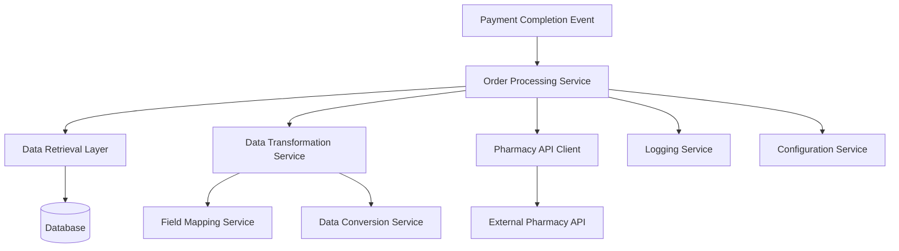

# Design Document

## Overview

The pharmacy order integration system is a service layer component that bridges the internal hospital prescription system with an external pharmacy fulfillment system. When a patient completes payment for a prescription drug order, this system automatically transforms the internal data model into the pharmacy API's required format and transmits the order for fulfillment.

The design follows a layered architecture with clear separation between data access, business logic, and external integration concerns. The system prioritizes data integrity, error handling, and performance optimization through strategic query design and caching.

## Architecture

### High-Level Architecture



### Component Layers

1. **Service Layer**: Orchestrates the order processing workflow
2. **Data Access Layer**: Optimized queries for retrieving order information
3. **Transformation Layer**: Maps and converts data between internal and external formats
4. **Integration Layer**: Handles HTTP communication with pharmacy API
5. **Cross-Cutting Concerns**: Logging, configuration, error handling

## Components and Interfaces

### 1. PharmacyOrderService

Main orchestration service that coordinates the order push workflow.

```java
@Service
public class PharmacyOrderService {
    
    @Autowired
    private OrderDataRetriever orderDataRetriever;
    
    @Autowired
    private PharmacyOrderMapper pharmacyOrderMapper;
    
    @Autowired
    private PharmacyApiClient pharmacyApiClient;
    
    @Autowired
    private OrderStatusUpdater orderStatusUpdater;
    
    /**
     * Process and push order to pharmacy system
     * @param orderNum The order number to process
     * @return Processing result with status and message
     */
    public OrderPushResult pushOrderToPharmacy(String orderNum) {
        // Implementation will be in tasks
    }
}
```

### 2. OrderDataRetriever

Responsible for retrieving order data using optimized queries.

```java
@Component
public class OrderDataRetriever {
    
    @Autowired
    private OrderMainInfoMapper orderMainInfoMapper;
    
    @Autowired
    private DrugListMapper drugListMapper;
    
    /**
     * Retrieve order main information (order, prescription, patient, doctor)
     * Uses single query with LEFT JOINs
     */
    public OrderMainInfo getOrderMainInfo(String orderNum) {
        // Implementation will be in tasks
    }
    
    /**
     * Retrieve drug list for the order
     * Separate query to avoid cartesian product
     */
    public List<DrugInfo> getDrugList(String orderNum) {
        // Implementation will be in tasks
    }
}
```

### 3. PharmacyOrderMapper

Transforms internal data structures to pharmacy API format.

```java
@Component
public class PharmacyOrderMapper {
    
    @Autowired
    private DataConverter dataConverter;
    
    /**
     * Map internal order data to pharmacy API request format
     */
    public PharmacyOrderRequest mapToPharmacyOrder(
        OrderMainInfo mainInfo, 
        List<DrugInfo> drugList) {
        // Implementation will be in tasks
    }
    
    private OrderInfo buildOrderInfo(OrderMainInfo mainInfo) {
        // Implementation will be in tasks
    }
    
    private List<GoodsItem> buildGoodsList(List<DrugInfo> drugList) {
        // Implementation will be in tasks
    }
    
    private ContactInfo buildContactInfo(OrderMainInfo mainInfo) {
        // Implementation will be in tasks
    }
    
    private PrescriptionInfo buildPrescriptionInfo(OrderMainInfo mainInfo) {
        // Implementation will be in tasks
    }
}
```

### 4. DataConverter

Handles all data type conversions.

```java
@Component
public class DataConverter {
    
    /**
     * Convert Yuan (元) to Fen (分)
     * @param yuanAmount Amount in Yuan as String
     * @return Amount in Fen as Integer
     */
    public Integer convertYuanToFen(String yuanAmount) {
        // Implementation will be in tasks
    }
    
    /**
     * Convert internal sex code to pharmacy API format
     * @param internalSex "1" for male, "0" for female
     * @return "m" for male, "f" for female
     */
    public String convertSex(String internalSex) {
        // Implementation will be in tasks
    }
    
    /**
     * Convert string quantity to integer
     */
    public Integer convertQuantity(String quantity) {
        // Implementation will be in tasks
    }
    
    /**
     * Format birthday to YYYY-MM-DD
     */
    public String formatBirthday(String birthday) {
        // Implementation will be in tasks
    }
}
```

### 5. PharmacyApiClient

Handles HTTP communication with pharmacy API.

```java
@Component
public class PharmacyApiClient {
    
    @Autowired
    private RestTemplate restTemplate;
    
    @Autowired
    private PharmacyConfig pharmacyConfig;
    
    /**
     * Send order to pharmacy API with retry logic
     * @param request The pharmacy order request
     * @return API response
     */
    public PharmacyOrderResponse sendOrder(PharmacyOrderRequest request) {
        // Implementation will be in tasks
    }
    
    /**
     * Build complete API URL with secret key
     */
    private String buildApiUrl() {
        // Implementation will be in tasks
    }
}
```

### 6. Configuration Management

```java
@Configuration
@ConfigurationProperties(prefix = "pharmacy.api")
public class PharmacyConfig {
    private String baseUrl;
    private String secretKey;
    private int retryCount = 3;
    private int timeoutSeconds = 30;
    private String defaultOrderNote = "";
    
    // Getters and setters
}
```

## Data Models

### Internal Data Models

```java
/**
 * Aggregated order main information from multiple tables
 */
public class OrderMainInfo {
    // Order fields
    private String orderNum;
    private String totalPrice;
    
    // Contact fields
    private String name;
    private String mobile;
    private String province;
    private String city;
    private String district;
    private String address;
    
    // Prescription fields
    private String prescriptionNum;
    private String prescriptionImg;
    private String medicalCertificate;
    private String departName;
    
    // Patient fields (from prescription table)
    private String prescriptionPatientName;
    private String prescriptionSex;
    private String prescriptionAge;
    private String prescriptionMobile;
    
    // Patient supplementary (from patient table)
    private String birthDay;
    
    // Doctor fields
    private String doctorName;
    private String hospitalName;
    
    // Getters and setters
}

/**
 * Drug information for order
 */
public class DrugInfo {
    private String mshId;        // Pharmacy system drug ID
    private String number;       // Quantity
    private String price;        // Unit price in Yuan
    private String drugName;     // Drug name for logging
    
    // Getters and setters
}
```

### Pharmacy API Models

```java
/**
 * Complete pharmacy order request
 */
public class PharmacyOrderRequest {
    private OrderInfo orderInfo;
    private List<GoodsItem> goodsList;
    private ContactInfo contactInfo;
    private PrescriptionInfo presInfo;
    
    // Getters and setters
}

/**
 * Order information section
 */
public class OrderInfo {
    private String orderId;              // Required
    private Integer orderPriceFen;       // Required
    private Integer orderOriginPriceFen; // Required
    private Integer orderExpressFen;     // Optional
    private String notex;                // Optional
    
    // Getters and setters
}

/**
 * Goods item in order
 */
public class GoodsItem {
    private String goodsId;    // Required - msh_id
    private Integer num;       // Required
    private Integer originFen; // Required
    
    // Getters and setters
}

/**
 * Contact information
 */
public class ContactInfo {
    private String name;       // Required
    private String phone;      // Required
    private String province;   // Required
    private String city;       // Required
    private String country;    // Required (district)
    private String address;    // Required
    
    // Getters and setters
}

/**
 * Prescription information
 */
public class PrescriptionInfo {
    private String presNo;         // Optional
    private String presImgUrl;     // Optional
    private String patientName;    // Optional
    private String sex;            // Optional (m/f)
    private Integer age;           // Optional
    private String phoneNum;       // Optional
    private String diagnosis;      // Optional
    private String hospital;       // Optional
    private String clinic;         // Optional
    private String doctorName;     // Optional
    private String birthday;       // Optional (YYYY-MM-DD)
    
    // Getters and setters
}

/**
 * Pharmacy API response
 */
public class PharmacyOrderResponse {
    private Integer errorCode;  // 0 = success, 1 = failure
    private String errorMsg;
    
    // Getters and setters
}
```

### Result Models

```java
/**
 * Order push result
 */
public class OrderPushResult {
    private boolean success;
    private String orderNum;
    private String message;
    private PharmacyOrderResponse apiResponse;
    
    // Getters and setters
}
```

## Database Query Strategy

### Query 1: Order Main Information

```sql
SELECT 
    -- Order basic info
    hpdo.order_num,
    hp.total_price,
    
    -- Contact info
    hpdo.name,
    hpdo.mobile,
    hpdo.province,
    hpdo.city,
    hpdo.district,
    hpdo.address,
    
    -- Prescription info
    hp.prescription_num,
    hp.img as prescription_img,
    hp.medical_certificate,
    hp.depart_name,
    
    -- Patient info (from prescription table only)
    hp.name as prescription_patient_name,
    hp.sex as prescription_sex,
    hp.age as prescription_age,
    hp.mobile as prescription_mobile,
    
    -- Patient supplementary (birthday from patient table)
    pu.birth_day,
    
    -- Doctor info
    du.name as doctor_name,
    du.hospital_name
FROM t_hos_pre_drug_order hpdo
LEFT JOIN t_hos_prescription hp ON hpdo.hos_prescription_id = hp.id
LEFT JOIN t_patient_user pu ON hp.patient_user_id = pu.id
LEFT JOIN t_doctor_user du ON hp.doctor_user_id = du.id
WHERE hpdo.order_num = ?
```

### Query 2: Drug List

```sql
SELECT 
    d.msh_id,
    hpd.number,
    hpd.price,
    hpd.name as drug_name
FROM t_hos_pre_drug_order hpdo
INNER JOIN t_hos_prescription hp ON hpdo.hos_prescription_id = hp.id
INNER JOIN t_hos_prescription_drug hpd ON hp.id = hpd.hos_prescription_id
INNER JOIN t_drug d ON hpd.drug_id = d.id
WHERE hpdo.order_num = ?
```

### Required Indexes

```sql
CREATE INDEX idx_order_num ON t_hos_pre_drug_order(order_num);
CREATE INDEX idx_hos_prescription_id ON t_hos_pre_drug_order(hos_prescription_id);
CREATE INDEX idx_prescription_drug_prescription_id ON t_hos_prescription_drug(hos_prescription_id);
CREATE INDEX idx_prescription_drug_drug_id ON t_hos_prescription_drug(drug_id);
CREATE INDEX idx_prescription_patient_id ON t_hos_prescription(patient_user_id);
CREATE INDEX idx_prescription_doctor_id ON t_hos_prescription(doctor_user_id);
```

## Error Handling

### Error Categories

1. **Data Validation Errors**
   - Missing required fields
   - Invalid data formats
   - Data conversion failures

2. **Database Errors**
   - Connection failures
   - Query timeouts
   - Data not found

3. **API Communication Errors**
   - Network timeouts
   - Connection refused
   - Invalid response format

4. **Business Logic Errors**
   - Order already pushed
   - Order in invalid state
   - Prescription expired

### Error Handling Strategy

```java
public class PharmacyOrderException extends RuntimeException {
    private ErrorCategory category;
    private String orderNum;
    private String details;
    
    // Constructor and getters
}

public enum ErrorCategory {
    DATA_VALIDATION,
    DATABASE_ERROR,
    API_COMMUNICATION,
    BUSINESS_LOGIC
}
```

### Retry Logic

- API communication errors: Retry up to 3 times with exponential backoff
- Database connection errors: Retry up to 2 times with 1 second delay
- Data validation errors: No retry, log and notify
- Business logic errors: No retry, log and notify

### Logging Strategy

```java
// Success logging
log.info("Order push started: orderNum={}", orderNum);
log.info("Order data retrieved: orderNum={}, drugCount={}", orderNum, drugList.size());
log.info("Order push successful: orderNum={}, apiResponse={}", orderNum, response);

// Error logging
log.error("Order push failed: orderNum={}, category={}, error={}", 
    orderNum, category, error.getMessage(), error);

// Debug logging (when enabled)
log.debug("Pharmacy API request: {}", JsonUtils.toJson(request));
log.debug("Pharmacy API response: {}", JsonUtils.toJson(response));
```

## Testing Strategy

### Unit Testing

1. **DataConverter Tests**
   - Test Yuan to Fen conversion with various decimal places
   - Test sex code conversion
   - Test quantity string to integer conversion
   - Test birthday format validation
   - Test null and empty string handling

2. **PharmacyOrderMapper Tests**
   - Test complete order mapping with all fields present
   - Test mapping with missing optional fields
   - Test mapping with null values
   - Test goods list mapping with multiple items

3. **OrderDataRetriever Tests**
   - Mock database responses
   - Test data retrieval with complete data
   - Test data retrieval with missing optional data
   - Test error handling for database failures

### Integration Testing

1. **Database Integration Tests**
   - Test actual queries against test database
   - Verify query performance
   - Test with various data scenarios

2. **API Integration Tests**
   - Mock pharmacy API responses
   - Test successful order push
   - Test API error responses
   - Test retry logic
   - Test timeout handling

3. **End-to-End Tests**
   - Test complete workflow from order number to API call
   - Test with real database data (test environment)
   - Verify logging output
   - Verify error handling paths

### Test Data Requirements

- Sample orders with complete data
- Sample orders with missing optional fields
- Sample orders with multiple drugs
- Sample orders with data conversion edge cases (e.g., prices with many decimal places)

## Configuration

### Application Properties

```yaml
pharmacy:
  api:
    base-url: https://prescription-center.hncjt.com/api/web/index.php/admin/yiliao/created-order
    secret-key: ${PHARMACY_SECRET_KEY}
    retry-count: 3
    timeout-seconds: 30
    default-order-note: ""
    
logging:
  level:
    com.pharmacy.integration: INFO
    
spring:
  datasource:
    hikari:
      maximum-pool-size: 20
      minimum-idle: 5
```

### Environment Variables

- `PHARMACY_SECRET_KEY`: Secret key for pharmacy API authentication

## Performance Considerations

1. **Query Optimization**
   - Use separate queries to avoid cartesian products
   - Ensure proper indexing on join columns
   - Use connection pooling

2. **Caching Strategy**
   - Cache doctor information (rarely changes)
   - Cache hospital information (rarely changes)
   - Cache configuration values

3. **Async Processing**
   - Consider async order pushing for high volume
   - Use message queue for retry handling

4. **Monitoring**
   - Track API response times
   - Monitor success/failure rates
   - Alert on high error rates

## Security Considerations

1. **API Authentication**
   - Store secret key in environment variables
   - Never log secret key values
   - Rotate keys periodically

2. **Data Privacy**
   - Log only necessary information
   - Mask sensitive patient data in logs
   - Use HTTPS for API communication

3. **Input Validation**
   - Validate all data before sending to API
   - Sanitize string inputs
   - Prevent injection attacks

## Deployment Considerations

1. **Database Migration**
   - Verify all required indexes exist
   - Test queries in production-like environment

2. **Configuration Management**
   - Use environment-specific configuration files
   - Validate configuration on startup

3. **Rollback Plan**
   - Feature flag to disable pharmacy integration
   - Manual order push capability as fallback

4. **Monitoring and Alerts**
   - Set up alerts for high error rates
   - Monitor API response times
   - Track order push success rates
