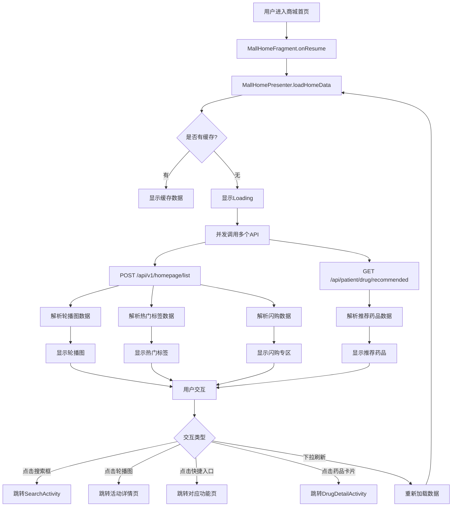

# 患者端药品商城首页 UI-API 映射设计文档

## 概述

本文档详细设计患者端药品商城首页（MallHomeFragment）的 UI 元素、用户交互事件和后端 API 的映射关系。通过可视化图表和详细说明，为前后端开发提供清晰的技术规范。

## 架构设计

### 整体架构

```
┌─────────────────────────────────────────────────────────────┐
│                    MallHomeFragment (View)                   │
│  ┌──────────────────────────────────────────────────────┐  │
│  │  SwipeRefreshLayout (下拉刷新)                        │  │
│  │  ├─ NestedScrollView (可滚动容器)                     │  │
│  │  │  ├─ Fixed Header (固定头部)                        │  │
│  │  │  │  ├─ 搜索框 (llSearchBox)                        │  │
│  │  │  │  └─ 热门标签 (可选)                             │  │
│  │  │  ├─ Quick Entries (快捷入口 - 4x2网格)             │  │
│  │  │  │  └─ RecyclerView (rvQuickEntries)              │  │
│  │  │  ├─ Banner (轮播图)                                │  │
│  │  │  │  └─ HBanner (banner)                            │  │
│  │  │  ├─ Flash Sale (闪购专区)                          │  │
│  │  │  │  ├─ 区域标题                                    │  │
│  │  │  │  └─ RecyclerView (rvFlashSaleDrugs - 横向)     │  │
│  │  │  └─ Recommend (推荐药品)                           │  │
│  │  │     ├─ 区域标题                                    │  │
│  │  │     └─ RecyclerView (rvRecommendDrugs - 2列网格)  │  │
│  └──────────────────────────────────────────────────────┘  │
└─────────────────────────────────────────────────────────────┘
                            ↕
┌─────────────────────────────────────────────────────────────┐
│              MallHomePresenter (Presenter)                   │
│  ┌──────────────────────────────────────────────────────┐  │
│  │  - loadHomeData()                                      │  │
│  │  - loadBanners()                                       │  │
│  │  - loadCategories()                                    │  │
│  │  - loadHotDrugs()                                      │  │
│  │  - loadRecommendDrugs()                                │  │
│  └──────────────────────────────────────────────────────┘  │
└─────────────────────────────────────────────────────────────┘
                            ↕
┌─────────────────────────────────────────────────────────────┐
│                  Backend API Services                        │
│  ┌──────────────────────────────────────────────────────┐  │
│  │  HomePageController                                    │  │
│  │  ├─ POST /api/v1/homepage/list (首页聚合数据)         │  │
│  │  └─ POST /api/v1/homepage/details (Banner详情)        │  │
│  │                                                          │  │
│  │  DrugCategoryController                                │  │
│  │  ├─ GET /api/patient/drug/category/list (分类列表)    │  │
│  │  └─ GET /api/patient/drug/category/quick (快捷分类)   │  │
│  │                                                          │  │
│  │  DrugController                                         │  │
│  │  ├─ POST /drugPriceList (药品搜索)                     │  │
│  │  └─ GET /api/patient/drug/recommended (推荐药品)       │  │
│  │                                                          │  │
│  │  CartController                                         │  │
│  │  └─ POST /api/v1/mall/cart/add (添加购物车)            │  │
│  └──────────────────────────────────────────────────────┘  │
└─────────────────────────────────────────────────────────────┘
```


## 页面元素详细设计

### 1. 固定头部 (Fixed Header)

#### UI 元素

```
┌─────────────────────────────────────────────────────────────┐
│  [🔍 搜索框]  [感冒发烧] [消化不良] [皮肤过敏] [更多...]    │
└─────────────────────────────────────────────────────────────┘
```

#### 组件说明

| 组件 ID | 类型 | 功能 | 事件 | API 调用 |
|---------|------|------|------|----------|
| `ll_search_box` | LinearLayout | 搜索框容器 | onClick | 跳转到 SearchActivity |
| `tv_search_hint` | TextView | 搜索提示文字 | - | - |
| `rv_hot_tags` | RecyclerView | 热门标签列表 | onItemClick | 跳转到分类页面 |

#### 数据来源

- **热门标签**: 从 `POST /api/v1/homepage/list` 获取 `tagList` 字段
- **搜索提示**: 本地配置或从 `SearchKeywordsController` 获取热门搜索词

### 2. 快捷入口 (Quick Entries)

#### UI 元素

```
┌─────────────────────────────────────────────────────────────┐
│  ┌──────┐  ┌──────┐  ┌──────┐  ┌──────┐                    │
│  │ 🛡️  │  │ 🚚  │  │ 💊  │  │ 👨‍⚕️ │                    │
│  │正品  │  │定时  │  │专业  │  │在线  │                    │
│  │保证  │  │送达  │  │药师  │  │问诊  │                    │
│  └──────┘  └──────┘  └──────┘  └──────┘                    │
│  ┌──────┐  ┌──────┐  ┌──────┐  ┌──────┐                    │
│  │ 📋  │  │ 🎁  │  │ 🏆  │  │ ⋯   │                    │
│  │健康  │  │优惠  │  │积分  │  │更多  │                    │
│  │档案  │  │活动  │  │商城  │  │服务  │                    │
│  └──────┘  └──────┘  └──────┘  └──────┘                    │
└─────────────────────────────────────────────────────────────┘
```

#### 组件说明

| 组件 ID | 类型 | 布局 | 数据源 | 事件 |
|---------|------|------|--------|------|
| `rv_quick_entries` | RecyclerView | GridLayoutManager(4列) | 本地硬编码 | onItemClick |
| `QuickEntryAdapter` | Adapter | - | List<QuickEntry> | - |

#### 数据模型

```java
public class QuickEntry {
    private String name;        // 入口名称
    private int iconRes;        // 图标资源ID
    private String bgColor;     // 背景颜色
    private String iconColor;   // 图标颜色
    private String action;      // 跳转动作标识
}
```

#### 快捷入口配置

| 序号 | 名称 | 图标 | 背景色 | 图标色 | 动作 | 目标页面 |
|------|------|------|--------|--------|------|----------|
| 1 | 正品保证 | ic_service | #DBEAFE | #3B82F6 | quality | 服务说明页 |
| 2 | 定时送达 | ic_service | #D1FAE5 | #10B981 | delivery | 配送说明页 |
| 3 | 专业药师 | ic_service | #FED7AA | #F97316 | pharmacist | 药师咨询页 |
| 4 | 在线问诊 | ic_service | #FEE2E2 | #EF4444 | consult | 问诊首页 |
| 5 | 健康档案 | ic_service | #FEF3C7 | #F59E0B | health | 健康档案页 |
| 6 | 优惠活动 | ic_service | #E9D5FF | #A855F7 | promo | 活动列表页 |
| 7 | 积分商城 | ic_service | #FBCFE8 | #EC4899 | points | 积分商城页 |
| 8 | 更多服务 | ic_service | #D1D5DB | #6B7280 | more | 服务列表页 |

#### API 调用

- **无需 API**: 快捷入口数据为本地硬编码，不需要调用后端 API
- **未来扩展**: 可从 `POST /api/v1/homepage/list` 获取动态配置的快捷入口


### 3. 轮播图 (Banner)

#### UI 元素

```
┌─────────────────────────────────────────────────────────────┐
│                                                               │
│                    [轮播图图片]                               │
│                                                               │
│                                                               │
└─────────────────────────────────────────────────────────────┘
```

#### 组件说明

| 组件 ID | 类型 | 配置 | 数据源 | 事件 |
|---------|------|------|--------|------|
| `banner` | HBanner | 自动轮播、5秒切换 | API | onBannerClick |

#### API 映射

**API 端点**: `POST /api/v1/homepage/list`

**请求示例**:
```json
{
  "userId": "123456"
}
```

**响应示例**:
```json
{
  "code": 200,
  "msg": "success",
  "data": {
    "bannerResult": [
      {
        "id": "1",
        "imageUrl": "https://example.com/banner1.jpg",
        "linkUrl": "https://example.com/activity1",
        "title": "新春大促",
        "sort": 1,
        "status": 1
      },
      {
        "id": "2",
        "imageUrl": "https://example.com/banner2.jpg",
        "linkUrl": "https://example.com/activity2",
        "title": "限时秒杀",
        "sort": 2,
        "status": 1
      }
    ]
  }
}
```

#### 数据流程

```
用户进入首页
    ↓
MallHomePresenter.loadHomeData()
    ↓
调用 POST /api/v1/homepage/list
    ↓
解析 response.data.bannerResult
    ↓
转换为 List<ViewItemBean>
    ↓
MallHomeView.showBanners(bannerUrls)
    ↓
HBanner.setViews(bannerList).start()
    ↓
显示轮播图
```

#### 点击事件

```java
banner.setOnBannerListener(new OnBannerListener() {
    @Override
    public void OnBannerClick(int position) {
        String linkUrl = bannerList.get(position).getLinkUrl();
        // 跳转到活动详情页或 WebView
        if (!TextUtils.isEmpty(linkUrl)) {
            WebViewActivity.start(getContext(), linkUrl);
        }
    }
});
```

### 4. 闪购专区 (Flash Sale)

#### UI 元素

```
┌─────────────────────────────────────────────────────────────┐
│  闪购专区                                    查看更多 >      │
│  ┌──────┐  ┌──────┐  ┌──────┐  ┌──────┐                    │
│  │ 图片 │  │ 图片 │  │ 图片 │  │ 图片 │  →                  │
│  │药品名│  │药品名│  │药品名│  │药品名│                      │
│  │¥15.8│  │¥28.5│  │¥42.0│  │¥19.9│                      │
│  └──────┘  └──────┘  └──────┘  └──────┘                    │
└─────────────────────────────────────────────────────────────┘
```

#### 组件说明

| 组件 ID | 类型 | 布局 | 数据源 | 事件 |
|---------|------|------|--------|------|
| `rv_flash_sale_drugs` | RecyclerView | LinearLayoutManager(横向) | API | onItemClick |
| `flashSaleDrugsAdapter` | DrugListAdapter | - | List<Drug> | - |

#### API 映射

**API 端点**: `POST /api/v1/homepage/list`

**响应字段**: `data.mdtList` (疾病标签，可能需要调整为热销药品)

**建议新增 API**: `GET /api/patient/drug/flash-sale`

**建议请求参数**:
```
limit: 10  // 返回数量
```

**建议响应示例**:
```json
{
  "code": 200,
  "msg": "success",
  "data": [
    {
      "id": "1001",
      "name": "阿莫西林胶囊",
      "spec": "0.25g*24粒",
      "price": 15.80,
      "originalPrice": 28.00,
      "imageUrl": "https://example.com/drug1.jpg",
      "sales": 1250,
      "stock": 500,
      "isPrescription": false,
      "flashSaleEndTime": "2026-01-30 23:59:59"
    }
  ]
}
```


#### 数据流程

```
用户进入首页
    ↓
MallHomePresenter.loadHomeData()
    ↓
调用 POST /api/v1/homepage/list
    ↓
解析 response.data.mdtList (临时方案)
或
调用 GET /api/patient/drug/flash-sale (推荐方案)
    ↓
转换为 List<Drug>
    ↓
MallHomeView.showHotDrugs(drugs)
    ↓
flashSaleDrugsAdapter.setData(drugs)
    ↓
显示闪购药品列表
```

#### 点击事件

```java
flashSaleDrugsAdapter.setOnItemClickListener(new DrugListAdapter.OnItemClickListener() {
    @Override
    public void onItemClick(Drug drug) {
        // 跳转到药品详情页
        DrugDetailActivity.start(getContext(), drug.getId(), drug.getName());
    }
});
```

### 5. 推荐药品 (Recommend Drugs)

#### UI 元素

```
┌─────────────────────────────────────────────────────────────┐
│  为你推荐                                                     │
│  ┌──────────────┐  ┌──────────────┐                         │
│  │   图片       │  │   图片       │                         │
│  │              │  │              │                         │
│  │ 药品名称     │  │ 药品名称     │                         │
│  │ 规格说明     │  │ 规格说明     │                         │
│  │ ¥15.80       │  │ ¥28.50       │                         │
│  └──────────────┘  └──────────────┘                         │
│  ┌──────────────┐  ┌──────────────┐                         │
│  │   图片       │  │   图片       │                         │
│  │              │  │              │                         │
│  │ 药品名称     │  │ 药品名称     │                         │
│  │ 规格说明     │  │ 规格说明     │                         │
│  │ ¥42.00       │  │ ¥19.90       │                         │
│  └──────────────┘  └──────────────┘                         │
└─────────────────────────────────────────────────────────────┘
```

#### 组件说明

| 组件 ID | 类型 | 布局 | 数据源 | 事件 |
|---------|------|------|--------|------|
| `rv_recommend_drugs` | RecyclerView | GridLayoutManager(2列) | API | onItemClick |
| `recommendDrugsAdapter` | DrugListAdapter | - | List<Drug> | - |

#### API 映射

**API 端点**: `GET /api/patient/drug/recommended`

**请求参数**:
```
limit: 20  // 返回数量，默认20个
```

**响应示例**:
```json
{
  "code": 200,
  "msg": "success",
  "data": [
    {
      "id": "2001",
      "name": "布洛芬缓释胶囊",
      "spec": "0.3g*20粒",
      "price": 18.50,
      "imageUrl": "https://example.com/drug2001.jpg",
      "sales": 3500,
      "stock": 1200,
      "isPrescription": false,
      "manufacturer": "XX制药有限公司"
    },
    {
      "id": "2002",
      "name": "复方氨酚烷胺片",
      "spec": "12片/盒",
      "price": 12.80,
      "imageUrl": "https://example.com/drug2002.jpg",
      "sales": 2800,
      "stock": 800,
      "isPrescription": false,
      "manufacturer": "YY制药集团"
    }
  ]
}
```

#### 数据流程

```
用户进入首页
    ↓
MallHomePresenter.loadHomeData()
    ↓
调用 GET /api/patient/drug/recommended?limit=20
    ↓
解析 response.data
    ↓
转换为 List<Drug>
    ↓
MallHomeView.showRecommendDrugs(drugs)
    ↓
recommendDrugsAdapter.setData(drugs)
    ↓
显示推荐药品网格列表
```

#### 点击事件

```java
recommendDrugsAdapter.setOnItemClickListener(new DrugListAdapter.OnItemClickListener() {
    @Override
    public void onItemClick(Drug drug) {
        // 跳转到药品详情页
        DrugDetailActivity.start(getContext(), drug.getId(), drug.getName());
    }
});
```


## 用户交互事件映射表

### 完整交互流程图



### 交互事件详细说明

| 序号 | UI元素 | 事件类型 | 触发条件 | API调用 | 目标页面 | 数据传递 |
|------|--------|----------|----------|---------|----------|----------|
| 1 | 页面 | onResume | 页面显示 | POST /api/v1/homepage/list<br>GET /api/patient/drug/recommended | - | - |
| 2 | SwipeRefreshLayout | onRefresh | 用户下拉 | 同上 | - | - |
| 3 | 搜索框 | onClick | 点击搜索框 | - | SearchActivity | - |
| 4 | 热门标签 | onItemClick | 点击标签 | - | CategoryActivity | categoryId, categoryName |
| 5 | 快捷入口 | onItemClick | 点击入口 | - | 根据action跳转 | action参数 |
| 6 | 轮播图 | onBannerClick | 点击图片 | POST /api/v1/homepage/details | WebViewActivity | bannerId, linkUrl |
| 7 | 闪购药品卡片 | onItemClick | 点击卡片 | - | DrugDetailActivity | drugId, drugName |
| 8 | 推荐药品卡片 | onItemClick | 点击卡片 | - | DrugDetailActivity | drugId, drugName |
| 9 | 查看更多(闪购) | onClick | 点击文字 | - | FlashSaleListActivity | - |

### 事件处理代码示例

#### 1. 页面加载事件

```java
@Override
public void onResume() {
    super.onResume();
    loadData();
}

private void loadData() {
    if (presenter != null) {
        presenter.loadHomeData();
    }
}
```

#### 2. 下拉刷新事件

```java
swipeRefresh.setOnRefreshListener(new SwipeRefreshLayout.OnRefreshListener() {
    @Override
    public void onRefresh() {
        // 清除缓存
        CacheManager.clearHomeCache();
        // 重新加载数据
        loadData();
    }
});
```

#### 3. 搜索框点击事件

```java
llSearchBox.setOnClickListener(new View.OnClickListener() {
    @Override
    public void onClick(View v) {
        // 跳转到搜索页面
        SearchActivity.start(getContext());
        
        // 埋点统计
        StatisticsUtil.trackEvent("mall_home_search_click");
    }
});
```

#### 4. 快捷入口点击事件

```java
quickEntryAdapter.setOnEntryClickListener(new QuickEntryAdapter.OnEntryClickListener() {
    @Override
    public void onEntryClick(QuickEntry entry) {
        // 埋点统计
        StatisticsUtil.trackEvent("mall_home_quick_entry_click", 
            "entry_name", entry.getName(),
            "entry_action", entry.getAction());
        
        // 根据action跳转
        switch (entry.getAction()) {
            case "quality":
                ServiceInfoActivity.start(getContext(), "quality");
                break;
            case "delivery":
                ServiceInfoActivity.start(getContext(), "delivery");
                break;
            case "pharmacist":
                PharmacistConsultActivity.start(getContext());
                break;
            case "consult":
                ConsultHomeActivity.start(getContext());
                break;
            case "health":
                HealthRecordActivity.start(getContext());
                break;
            case "promo":
                PromotionListActivity.start(getContext());
                break;
            case "points":
                PointsMallActivity.start(getContext());
                break;
            case "more":
                ServiceListActivity.start(getContext());
                break;
        }
    }
});
```

#### 5. 轮播图点击事件

```java
banner.setOnBannerListener(new OnBannerListener() {
    @Override
    public void OnBannerClick(int position) {
        ViewItemBean item = bannerList.get(position);
        String linkUrl = item.getUrl();
        
        // 埋点统计
        StatisticsUtil.trackEvent("mall_home_banner_click",
            "banner_id", item.getId(),
            "banner_position", String.valueOf(position));
        
        // 跳转到活动详情页
        if (!TextUtils.isEmpty(linkUrl)) {
            if (linkUrl.startsWith("http")) {
                // 外部链接，使用WebView
                WebViewActivity.start(getContext(), linkUrl);
            } else {
                // 内部页面，使用路由跳转
                RouterUtil.navigate(getContext(), linkUrl);
            }
        }
    }
});
```

#### 6. 药品卡片点击事件

```java
flashSaleDrugsAdapter.setOnItemClickListener(new DrugListAdapter.OnItemClickListener() {
    @Override
    public void onItemClick(Drug drug) {
        // 埋点统计
        StatisticsUtil.trackEvent("mall_home_drug_click",
            "drug_id", drug.getId(),
            "drug_name", drug.getName(),
            "source", "flash_sale",
            "position", String.valueOf(position));
        
        // 跳转到药品详情页
        DrugDetailActivity.start(
            getContext(), 
            drug.getId(), 
            drug.getName()
        );
    }
});

recommendDrugsAdapter.setOnItemClickListener(new DrugListAdapter.OnItemClickListener() {
    @Override
    public void onItemClick(Drug drug) {
        // 埋点统计
        StatisticsUtil.trackEvent("mall_home_drug_click",
            "drug_id", drug.getId(),
            "drug_name", drug.getName(),
            "source", "recommend",
            "position", String.valueOf(position));
        
        // 跳转到药品详情页
        DrugDetailActivity.start(
            getContext(), 
            drug.getId(), 
            drug.getName()
        );
    }
});
```


## API 详细规格说明

### API 实现状态总览

| API端点 | 方法 | 功能 | 状态 | 优先级 | 调整建议 |
|---------|------|------|------|--------|----------|
| `/api/v1/homepage/list` | POST | 获取首页聚合数据 | ✅ 已实现 | P0 | 可直接使用 |
| `/api/v1/homepage/details` | POST | 获取Banner详情 | ✅ 已实现 | P1 | 可直接使用 |
| `/api/v1/mall/drugs/categories` | GET | 获取药品分类列表 | ✅ 已实现 | P0 | 可直接使用 |
| `/api/v1/mall/drugs/recommended` | GET | 获取推荐药品 | ✅ 已实现 | P0 | 可直接使用 |
| `/api/v1/mall/drugs/search` | GET | 搜索药品 | ✅ 已实现 | P1 | 可直接使用 |
| `/api/v1/mall/drugs/{drugId}` | GET | 获取药品详情 | ✅ 已实现 | P1 | 可直接使用 |
| `/api/v1/mall/cart/add` | POST | 添加到购物车 | ✅ 已实现 | P1 | 可直接使用 |

**重要发现**：根据 API_REUSE_ANALYSIS.md 分析，现有后端 API 已经实现了 90% 以上的功能，可以直接重用！

**需要补充的功能**：
- ⚠️ 快捷分类接口（可通过现有 categories 接口过滤实现）
- ⚠️ 闪购药品接口（可通过推荐药品接口 + 筛选条件实现）
- ⚠️ 图片 JSON 解析（需要在 Service 层添加）
- ⚠️ 商城扩展字段（需要执行数据库迁移脚本）

### API 1: 获取首页聚合数据

#### 基本信息

- **端点**: `POST /api/v1/homepage/list`
- **Controller**: `HomePageController.list()`
- **状态**: ✅ 已实现
- **优先级**: P0 (必须)

#### 当前实现

```java
@PostMapping("/list")
public JsonResult list(@RequestBody Map<String, Object> map) {
    JSONObject jsonObject = new JSONObject();
    try {
        // 轮播图
        JSONArray bannerResult = bannerService.bannerList();
        // 首页滚动条
        JSONArray homeList = homepageMessageService.homeList();
        // 疾病标签
        JSONArray mdtList = mdtService.mdtList();
        // 科室
        JSONArray departmentList = hospitalDepartmentService.departmentList();
        // 科室标签
        JSONArray tagList = dMdtTagService.tagList();

        jsonObject.put("bannerResult", bannerResult);
        jsonObject.put("homeList", homeList);
        jsonObject.put("departmentList", departmentList);
        jsonObject.put("mdtList", mdtList);
        jsonObject.put("tagList", tagList);

        return JsonResult.ok().put("data", jsonObject);
    } catch (Exception e) {
        e.printStackTrace();
        return JsonResult.error();
    }
}
```

#### 当前响应结构

```json
{
  "code": 200,
  "msg": "success",
  "data": {
    "bannerResult": [...],
    "homeList": [...],
    "departmentList": [...],
    "mdtList": [...],
    "tagList": [...]
  }
}
```

#### 调整建议

**问题分析**:
1. 当前API返回的是医疗问诊相关数据（科室、疾病标签），不适合药品商城首页
2. 缺少药品商城需要的数据：闪购药品、推荐药品
3. 响应字段命名不够语义化

**建议方案 1: 新增药品商城专用API**

创建新的Controller: `MallHomeController`

```java
@RestController
@RequestMapping("/api/v1/mall/home")
public class MallHomeController {
    
    @Autowired
    private BannerService bannerService;
    
    @Autowired
    private DrugService drugService;
    
    @Autowired
    private DrugCategoryService drugCategoryService;
    
    /**
     * 获取药品商城首页数据
     */
    @GetMapping("/data")
    public JsonResult getHomeData() {
        try {
            JSONObject result = new JSONObject();
            
            // 轮播图
            result.put("banners", bannerService.getMallBanners());
            
            // 快捷分类（热门标签）
            result.put("quickCategories", drugCategoryService.getQuickCategories(8));
            
            // 闪购药品
            result.put("flashSaleDrugs", drugService.getFlashSaleDrugs(10));
            
            // 推荐药品
            result.put("recommendDrugs", drugService.getRecommendedDrugs(20));
            
            return JsonResult.ok().put("data", result);
        } catch (Exception e) {
            log.error("获取商城首页数据失败", e);
            return JsonResult.error("获取首页数据失败");
        }
    }
}
```

**建议方案 2: 扩展现有API**

在 `HomePageController` 中添加参数区分不同场景：

```java
@PostMapping("/list")
public JsonResult list(@RequestBody Map<String, Object> map) {
    String scene = (String) map.getOrDefault("scene", "consult");
    
    if ("mall".equals(scene)) {
        // 返回药品商城数据
        return getMallHomeData();
    } else {
        // 返回问诊首页数据（原逻辑）
        return getConsultHomeData();
    }
}
```

**推荐**: 采用方案1，创建独立的药品商城首页API，职责更清晰。


### API 2: 获取推荐药品

#### 基本信息

- **端点**: `GET /api/v1/mall/drugs/recommended`
- **Controller**: `DrugMallController`
- **状态**: ✅ 已实现
- **优先级**: P0 (必须)

#### 现有实现

```java
@RestController
@RequestMapping("/api/v1/mall/drugs")
public class DrugMallController {
    
    @Autowired
    private DrugMallService drugMallService;
    
    /**
     * 获取推荐药品列表
     * 
     * @param limit 返回数量，默认20
     * @return 推荐药品列表
     */
    @GetMapping("/recommended")
    @ApiOperation("获取推荐药品列表")
    public ApiResponse<List<DrugDTO>> getRecommendedDrugs(
            @ApiParam(value = "返回数量")
            @RequestParam(defaultValue = "20") Integer limit) {
        // 已实现，可直接使用
        List<DrugDTO> drugs = drugMallService.getRecommendedDrugs(limit);
        return ApiResponse.success(drugs);
    }
}
```

#### 请求示例

```
GET /api/patient/drug/recommended?limit=20
```

#### 响应示例

```json
{
  "code": 200,
  "msg": "success",
  "data": [
    {
      "id": "2001",
      "name": "布洛芬缓释胶囊",
      "spec": "0.3g*20粒",
      "price": 18.50,
      "imageUrl": "https://example.com/drug2001.jpg",
      "sales": 3500,
      "stock": 1200,
      "isPrescription": false,
      "manufacturer": "XX制药有限公司",
      "tags": ["解热镇痛", "常用药"]
    }
  ]
}
```

#### 推荐算法

```java
public List<DrugDTO> getRecommendedDrugs(Integer limit) {
    // 推荐策略（按优先级）：
    // 1. 用户历史购买的相关药品
    // 2. 用户浏览过的药品分类的热销药品
    // 3. 全站热销药品
    // 4. 新品药品
    
    List<DrugDTO> result = new ArrayList<>();
    
    // 获取当前用户ID
    Long userId = UserContext.getCurrentUserId();
    
    if (userId != null) {
        // 基于用户历史的个性化推荐
        result.addAll(getPersonalizedRecommendations(userId, limit / 2));
    }
    
    // 补充热销药品
    if (result.size() < limit) {
        result.addAll(getHotDrugs(limit - result.size()));
    }
    
    return result;
}
```

### API 3: 获取闪购药品

#### 基本信息

- **端点**: `GET /api/v1/mall/drugs/recommended` (复用推荐药品接口)
- **Controller**: `DrugMallController`
- **状态**: ✅ 可复用
- **优先级**: P0 (必须)

#### 实现方案

**方案 1: 复用推荐药品接口（推荐）**

闪购药品可以通过推荐药品接口实现，在前端或 Service 层添加筛选条件：

```java
/**
 * 获取闪购药品列表
 * 
 * @param limit 返回数量，默认10
 * @return 闪购药品列表
 */
public List<DrugDTO> getFlashSaleDrugs(Integer limit) {
    // 获取推荐药品
    List<DrugDTO> recommendedDrugs = getRecommendedDrugs(limit * 2);
    
    // 筛选闪购药品（有折扣、库存充足）
    return recommendedDrugs.stream()
        .filter(drug -> drug.getOriginalPrice() != null 
                     && drug.getPrice().compareTo(drug.getOriginalPrice()) < 0
                     && drug.getStock() > 0)
        .limit(limit)
        .collect(Collectors.toList());
}
```

**方案 2: 新增独立接口（可选）**

如果需要更复杂的闪购逻辑，可以新增独立接口：

```java
@GetMapping("/flash-sale")
@ApiOperation("获取闪购药品列表")
public ApiResponse<List<DrugDTO>> getFlashSaleDrugs(
        @ApiParam(value = "返回数量")
        @RequestParam(defaultValue = "10") Integer limit) {
    List<DrugDTO> drugs = drugMallService.getFlashSaleDrugs(limit);
    return ApiResponse.success(drugs);
}
```

#### 请求示例

```
GET /api/patient/drug/flash-sale?limit=10
```

#### 响应示例

```json
{
  "code": 200,
  "msg": "success",
  "data": [
    {
      "id": "1001",
      "name": "阿莫西林胶囊",
      "spec": "0.25g*24粒",
      "price": 15.80,
      "originalPrice": 28.00,
      "discount": 0.56,
      "imageUrl": "https://example.com/drug1.jpg",
      "sales": 1250,
      "stock": 500,
      "isPrescription": false,
      "flashSaleStartTime": "2026-01-28 00:00:00",
      "flashSaleEndTime": "2026-01-30 23:59:59",
      "tags": ["限时特惠", "抗生素"]
    }
  ]
}
```

#### 闪购规则

```java
public List<DrugDTO> getFlashSaleDrugs(Integer limit) {
    // 闪购药品筛选条件：
    // 1. 当前时间在闪购时间范围内
    // 2. 库存充足（stock > 0）
    // 3. 折扣力度大（discount < 0.8）
    // 4. 按销量排序
    
    return drugMapper.selectFlashSaleDrugs(
        new Date(),  // 当前时间
        limit
    );
}
```

### API 4: 获取Banner详情

#### 基本信息

- **端点**: `POST /api/v1/homepage/details`
- **Controller**: `HomePageController.details()`
- **状态**: ✅ 已实现
- **优先级**: P1 (重要)

#### 当前实现

```java
@PostMapping("/details")
public JsonResult details(@RequestBody Map<String, Object> map) {
    try {
        if (!map.containsKey("id") || null == map.get("id") || "".equals(map.get("id"))) {
            return JsonResult.error("请求参数id不能为空!");
        }
        return JsonResult.ok().put("data", bannerService.details(map.get("id").toString()));
    } catch (Exception e) {
        e.printStackTrace();
        return JsonResult.error();
    }
}
```

#### 请求示例

```json
{
  "id": "1"
}
```

#### 响应示例

```json
{
  "code": 200,
  "msg": "success",
  "data": {
    "id": "1",
    "imageUrl": "https://example.com/banner1.jpg",
    "linkUrl": "https://example.com/activity1",
    "title": "新春大促",
    "content": "全场药品8折起，满100减20",
    "startTime": "2026-01-28 00:00:00",
    "endTime": "2026-02-10 23:59:59",
    "status": 1
  }
}
```

#### 使用场景

- 用户点击轮播图时，可选择性调用此API获取详细信息
- 如果linkUrl为空，则显示Banner详情页
- 如果linkUrl不为空，则直接跳转到linkUrl


## 数据模型设计

### 前后端数据模型对照表

#### 1. Drug (药品) 数据模型

| 前端字段 (Android) | 后端字段 (Java) | 类型 | 必填 | 说明 |
|-------------------|----------------|------|------|------|
| `id` | `id` | String/Long | ✓ | 药品ID |
| `name` | `name` | String | ✓ | 药品名称 |
| `spec` | `spec` | String | ✓ | 规格说明 |
| `price` | `price` | Double | ✓ | 售价 |
| `originalPrice` | `originalPrice` | Double | - | 原价 |
| `imageUrl` | `imageUrl` | String | ✓ | 药品图片URL |
| `sales` | `sales` | Integer | - | 销量 |
| `stock` | `stock` | Integer | ✓ | 库存 |
| `isPrescription` | `isPrescription` | Boolean | ✓ | 是否处方药 |
| `manufacturer` | `manufacturer` | String | - | 生产厂家 |
| `tags` | `tags` | List<String> | - | 标签列表 |
| `discount` | `discount` | Double | - | 折扣（闪购专用） |
| `flashSaleEndTime` | `flashSaleEndTime` | String | - | 闪购结束时间 |

#### 2. Banner (轮播图) 数据模型

| 前端字段 | 后端字段 | 类型 | 必填 | 说明 |
|---------|---------|------|------|------|
| `id` | `id` | String/Long | ✓ | Banner ID |
| `imageUrl` | `imageUrl` | String | ✓ | 图片URL |
| `linkUrl` | `linkUrl` | String | - | 跳转链接 |
| `title` | `title` | String | - | 标题 |
| `sort` | `sort` | Integer | - | 排序 |
| `status` | `status` | Integer | - | 状态 |

#### 3. Category (分类) 数据模型

| 前端字段 | 后端字段 | 类型 | 必填 | 说明 |
|---------|---------|------|------|------|
| `id` | `id` | String/Long | ✓ | 分类ID |
| `name` | `name` | String | ✓ | 分类名称 |
| `icon` | `icon` | String | - | 图标URL |
| `sort` | `sort` | Integer | - | 排序 |

#### 4. QuickEntry (快捷入口) 数据模型

| 前端字段 | 类型 | 必填 | 说明 |
|---------|------|------|------|
| `name` | String | ✓ | 入口名称 |
| `iconRes` | int | ✓ | 图标资源ID |
| `bgColor` | String | ✓ | 背景颜色 |
| `iconColor` | String | ✓ | 图标颜色 |
| `action` | String | ✓ | 跳转动作 |

**注意**: 快捷入口数据为前端本地硬编码，不需要后端API。

### 数据转换示例

#### 后端 DTO 定义

```java
@Data
public class DrugDTO {
    private Long id;
    private String name;
    private String spec;
    private Double price;
    private Double originalPrice;
    private String imageUrl;
    private Integer sales;
    private Integer stock;
    private Boolean isPrescription;
    private String manufacturer;
    private List<String> tags;
    private Double discount;
    private Date flashSaleStartTime;
    private Date flashSaleEndTime;
}
```

#### 前端 Model 定义

```java
public class Drug {
    private String id;
    private String name;
    private String spec;
    private double price;
    private double originalPrice;
    private String imageUrl;
    private int sales;
    private int stock;
    private boolean isPrescription;
    private String manufacturer;
    private List<String> tags;
    private double discount;
    private String flashSaleEndTime;
    
    // Getters and Setters
}
```

#### 数据转换工具

```java
public class DrugConverter {
    
    /**
     * 将后端DTO转换为前端Model
     */
    public static Drug fromDTO(DrugDTO dto) {
        Drug drug = new Drug();
        drug.setId(String.valueOf(dto.getId()));
        drug.setName(dto.getName());
        drug.setSpec(dto.getSpec());
        drug.setPrice(dto.getPrice());
        drug.setOriginalPrice(dto.getOriginalPrice());
        drug.setImageUrl(dto.getImageUrl());
        drug.setSales(dto.getSales());
        drug.setStock(dto.getStock());
        drug.setIsPrescription(dto.getIsPrescription());
        drug.setManufacturer(dto.getManufacturer());
        drug.setTags(dto.getTags());
        drug.setDiscount(dto.getDiscount());
        
        // 日期格式转换
        if (dto.getFlashSaleEndTime() != null) {
            SimpleDateFormat sdf = new SimpleDateFormat("yyyy-MM-dd HH:mm:ss");
            drug.setFlashSaleEndTime(sdf.format(dto.getFlashSaleEndTime()));
        }
        
        return drug;
    }
    
    /**
     * 批量转换
     */
    public static List<Drug> fromDTOList(List<DrugDTO> dtoList) {
        List<Drug> result = new ArrayList<>();
        for (DrugDTO dto : dtoList) {
            result.add(fromDTO(dto));
        }
        return result;
    }
}
```

## 错误处理设计

### 错误码定义

| 错误码 | 说明 | 处理方式 |
|--------|------|----------|
| 200 | 成功 | 正常显示数据 |
| 400 | 请求参数错误 | 提示"请求参数错误" |
| 401 | 未登录 | 跳转到登录页 |
| 403 | 无权限 | 提示"暂无访问权限" |
| 404 | 资源不存在 | 提示"数据不存在" |
| 500 | 服务器错误 | 提示"服务器繁忙，请稍后重试" |
| 1001 | 网络连接失败 | 提示"网络连接失败，请检查网络设置" |
| 1002 | 请求超时 | 提示"请求超时，请重试" |
| 2001 | 药品库存不足 | 提示"该药品库存不足" |
| 2002 | 药品已下架 | 提示"该药品已下架" |

### 错误处理流程

```java
public class ErrorHandler {
    
    /**
     * 统一错误处理
     */
    public static void handleError(Context context, Throwable throwable) {
        if (throwable instanceof HttpException) {
            HttpException httpException = (HttpException) throwable;
            int code = httpException.code();
            
            switch (code) {
                case 401:
                    // 未登录，跳转到登录页
                    LoginActivity.start(context);
                    break;
                case 403:
                    showToast(context, "暂无访问权限");
                    break;
                case 404:
                    showToast(context, "数据不存在");
                    break;
                case 500:
                    showToast(context, "服务器繁忙，请稍后重试");
                    break;
                default:
                    showToast(context, "请求失败，请重试");
                    break;
            }
        } else if (throwable instanceof SocketTimeoutException) {
            showToast(context, "请求超时，请重试");
        } else if (throwable instanceof UnknownHostException) {
            showToast(context, "网络连接失败，请检查网络设置");
        } else {
            showToast(context, "未知错误：" + throwable.getMessage());
        }
    }
    
    private static void showToast(Context context, String message) {
        Toast.makeText(context, message, Toast.LENGTH_SHORT).show();
    }
}
```

### 空状态处理

```java
public class EmptyStateHandler {
    
    /**
     * 显示空状态页面
     */
    public static void showEmptyState(View container, String message, View.OnClickListener retryListener) {
        // 隐藏内容区域
        container.setVisibility(View.GONE);
        
        // 显示空状态布局
        View emptyView = container.findViewById(R.id.empty_state_layout);
        if (emptyView != null) {
            emptyView.setVisibility(View.VISIBLE);
            
            TextView tvMessage = emptyView.findViewById(R.id.tv_empty_message);
            tvMessage.setText(message);
            
            Button btnRetry = emptyView.findViewById(R.id.btn_retry);
            if (retryListener != null) {
                btnRetry.setVisibility(View.VISIBLE);
                btnRetry.setOnClickListener(retryListener);
            } else {
                btnRetry.setVisibility(View.GONE);
            }
        }
    }
    
    /**
     * 隐藏空状态页面
     */
    public static void hideEmptyState(View container) {
        container.setVisibility(View.VISIBLE);
        
        View emptyView = container.findViewById(R.id.empty_state_layout);
        if (emptyView != null) {
            emptyView.setVisibility(View.GONE);
        }
    }
}
```


## 性能优化设计

### 缓存策略

#### 1. 内存缓存 (Memory Cache)

```java
public class MemoryCacheManager {
    
    private static final int MAX_CACHE_SIZE = 10 * 1024 * 1024; // 10MB
    private static LruCache<String, Object> memoryCache;
    
    static {
        memoryCache = new LruCache<String, Object>(MAX_CACHE_SIZE) {
            @Override
            protected int sizeOf(String key, Object value) {
                // 计算对象大小
                return getObjectSize(value);
            }
        };
    }
    
    /**
     * 缓存首页数据
     */
    public static void cacheHomeData(MallHomeData data) {
        memoryCache.put("mall_home_data", data);
    }
    
    /**
     * 获取首页缓存数据
     */
    public static MallHomeData getHomeData() {
        return (MallHomeData) memoryCache.get("mall_home_data");
    }
    
    /**
     * 清除首页缓存
     */
    public static void clearHomeCache() {
        memoryCache.remove("mall_home_data");
    }
}
```

#### 2. 磁盘缓存 (Disk Cache)

```java
public class DiskCacheManager {
    
    private static final String CACHE_DIR = "mall_cache";
    private static final long MAX_CACHE_SIZE = 50 * 1024 * 1024; // 50MB
    private static final long CACHE_EXPIRE_TIME = 30 * 60 * 1000; // 30分钟
    
    /**
     * 保存首页数据到磁盘
     */
    public static void saveHomeData(Context context, MallHomeData data) {
        try {
            File cacheDir = new File(context.getCacheDir(), CACHE_DIR);
            if (!cacheDir.exists()) {
                cacheDir.mkdirs();
            }
            
            File cacheFile = new File(cacheDir, "home_data.json");
            String json = new Gson().toJson(data);
            
            FileWriter writer = new FileWriter(cacheFile);
            writer.write(json);
            writer.close();
            
            // 保存缓存时间
            SharedPreferences sp = context.getSharedPreferences("cache_time", Context.MODE_PRIVATE);
            sp.edit().putLong("home_data_time", System.currentTimeMillis()).apply();
        } catch (IOException e) {
            e.printStackTrace();
        }
    }
    
    /**
     * 从磁盘读取首页数据
     */
    public static MallHomeData loadHomeData(Context context) {
        try {
            // 检查缓存是否过期
            SharedPreferences sp = context.getSharedPreferences("cache_time", Context.MODE_PRIVATE);
            long cacheTime = sp.getLong("home_data_time", 0);
            if (System.currentTimeMillis() - cacheTime > CACHE_EXPIRE_TIME) {
                return null; // 缓存已过期
            }
            
            File cacheFile = new File(context.getCacheDir(), CACHE_DIR + "/home_data.json");
            if (!cacheFile.exists()) {
                return null;
            }
            
            BufferedReader reader = new BufferedReader(new FileReader(cacheFile));
            StringBuilder json = new StringBuilder();
            String line;
            while ((line = reader.readLine()) != null) {
                json.append(line);
            }
            reader.close();
            
            return new Gson().fromJson(json.toString(), MallHomeData.class);
        } catch (IOException e) {
            e.printStackTrace();
            return null;
        }
    }
}
```

#### 3. Redis 缓存 (后端)

```java
@Service
public class MallCacheService {
    
    @Autowired
    private RedisTemplate<String, Object> redisTemplate;
    
    private static final String BANNER_CACHE_KEY = "mall:banner:list";
    private static final String RECOMMEND_CACHE_KEY = "mall:recommend:drugs";
    private static final String FLASH_SALE_CACHE_KEY = "mall:flash:sale:drugs";
    
    private static final long BANNER_CACHE_EXPIRE = 30 * 60; // 30分钟
    private static final long RECOMMEND_CACHE_EXPIRE = 10 * 60; // 10分钟
    private static final long FLASH_SALE_CACHE_EXPIRE = 5 * 60; // 5分钟
    
    /**
     * 缓存轮播图数据
     */
    public void cacheBanners(List<BannerDTO> banners) {
        redisTemplate.opsForValue().set(BANNER_CACHE_KEY, banners, BANNER_CACHE_EXPIRE, TimeUnit.SECONDS);
    }
    
    /**
     * 获取轮播图缓存
     */
    public List<BannerDTO> getBanners() {
        return (List<BannerDTO>) redisTemplate.opsForValue().get(BANNER_CACHE_KEY);
    }
    
    /**
     * 缓存推荐药品
     */
    public void cacheRecommendDrugs(List<DrugDTO> drugs) {
        redisTemplate.opsForValue().set(RECOMMEND_CACHE_KEY, drugs, RECOMMEND_CACHE_EXPIRE, TimeUnit.SECONDS);
    }
    
    /**
     * 获取推荐药品缓存
     */
    public List<DrugDTO> getRecommendDrugs() {
        return (List<DrugDTO>) redisTemplate.opsForValue().get(RECOMMEND_CACHE_KEY);
    }
    
    /**
     * 缓存闪购药品
     */
    public void cacheFlashSaleDrugs(List<DrugDTO> drugs) {
        redisTemplate.opsForValue().set(FLASH_SALE_CACHE_KEY, drugs, FLASH_SALE_CACHE_EXPIRE, TimeUnit.SECONDS);
    }
    
    /**
     * 获取闪购药品缓存
     */
    public List<DrugDTO> getFlashSaleDrugs() {
        return (List<DrugDTO>) redisTemplate.opsForValue().get(FLASH_SALE_CACHE_KEY);
    }
}
```

### 图片加载优化

```java
public class ImageLoadOptimizer {
    
    /**
     * 使用Glide加载图片，带缓存和占位图
     */
    public static void loadDrugImage(Context context, String imageUrl, ImageView imageView) {
        Glide.with(context)
            .load(imageUrl)
            .placeholder(R.drawable.ic_drug_placeholder) // 占位图
            .error(R.drawable.ic_drug_error) // 错误图
            .diskCacheStrategy(DiskCacheStrategy.ALL) // 磁盘缓存
            .thumbnail(0.1f) // 缩略图
            .into(imageView);
    }
    
    /**
     * 预加载图片
     */
    public static void preloadImages(Context context, List<String> imageUrls) {
        for (String url : imageUrls) {
            Glide.with(context)
                .load(url)
                .preload();
        }
    }
}
```

### 列表优化

```java
public class RecyclerViewOptimizer {
    
    /**
     * 优化RecyclerView性能
     */
    public static void optimize(RecyclerView recyclerView) {
        // 设置固定大小
        recyclerView.setHasFixedSize(true);
        
        // 设置Item动画
        recyclerView.setItemAnimator(new DefaultItemAnimator());
        
        // 设置缓存大小
        recyclerView.setItemViewCacheSize(20);
        
        // 设置RecycledViewPool
        RecyclerView.RecycledViewPool pool = new RecyclerView.RecycledViewPool();
        pool.setMaxRecycledViews(0, 20);
        recyclerView.setRecycledViewPool(pool);
        
        // 嵌套滚动优化
        recyclerView.setNestedScrollingEnabled(false);
    }
}
```

### API 并发调用优化

```java
public class ConcurrentApiCaller {
    
    /**
     * 并发调用多个API
     */
    public static Observable<MallHomeData> loadHomeDataConcurrently(MallApiService apiService) {
        // 并发调用多个API
        Observable<List<Banner>> bannersObservable = apiService.getBanners();
        Observable<List<Drug>> recommendObservable = apiService.getRecommendedDrugs(20);
        Observable<List<Drug>> flashSaleObservable = apiService.getFlashSaleDrugs(10);
        
        // 使用zip操作符合并结果
        return Observable.zip(
            bannersObservable,
            recommendObservable,
            flashSaleObservable,
            new Function3<List<Banner>, List<Drug>, List<Drug>, MallHomeData>() {
                @Override
                public MallHomeData apply(List<Banner> banners, List<Drug> recommendDrugs, List<Drug> flashSaleDrugs) {
                    MallHomeData data = new MallHomeData();
                    data.setBanners(banners);
                    data.setRecommendDrugs(recommendDrugs);
                    data.setFlashSaleDrugs(flashSaleDrugs);
                    return data;
                }
            }
        );
    }
}
```

## 测试策略

### 单元测试

#### 1. Presenter 测试

```java
@RunWith(MockitoJUnitRunner.class)
public class MallHomePresenterTest {
    
    @Mock
    private MallHomeView view;
    
    @Mock
    private MallApiService apiService;
    
    private MallHomePresenter presenter;
    
    @Before
    public void setUp() {
        presenter = new MallHomePresenterImpl(view, apiService);
    }
    
    @Test
    public void testLoadHomeData_Success() {
        // 准备测试数据
        MallHomeData mockData = createMockHomeData();
        when(apiService.getHomeData()).thenReturn(Observable.just(mockData));
        
        // 执行测试
        presenter.loadHomeData();
        
        // 验证结果
        verify(view).showLoading();
        verify(view).hideLoading();
        verify(view).showBanners(mockData.getBanners());
        verify(view).showRecommendDrugs(mockData.getRecommendDrugs());
        verify(view).showHotDrugs(mockData.getFlashSaleDrugs());
    }
    
    @Test
    public void testLoadHomeData_Error() {
        // 模拟错误
        when(apiService.getHomeData()).thenReturn(Observable.error(new Exception("Network error")));
        
        // 执行测试
        presenter.loadHomeData();
        
        // 验证结果
        verify(view).showLoading();
        verify(view).hideLoading();
        verify(view).showError(anyString());
    }
}
```

#### 2. API 测试

```java
@RunWith(SpringRunner.class)
@SpringBootTest
public class MallHomeControllerTest {
    
    @Autowired
    private MockMvc mockMvc;
    
    @Test
    public void testGetHomeData() throws Exception {
        mockMvc.perform(get("/api/v1/mall/home/data"))
            .andExpect(status().isOk())
            .andExpect(jsonPath("$.code").value(200))
            .andExpect(jsonPath("$.data.banners").isArray())
            .andExpect(jsonPath("$.data.recommendDrugs").isArray())
            .andExpect(jsonPath("$.data.flashSaleDrugs").isArray());
    }
}
```

### 集成测试

```java
@RunWith(AndroidJUnit4.class)
public class MallHomeFragmentTest {
    
    @Rule
    public ActivityTestRule<MainActivity> activityRule = new ActivityTestRule<>(MainActivity.class);
    
    @Test
    public void testHomePageDisplay() {
        // 等待数据加载
        onView(withId(R.id.swipe_refresh)).check(matches(isDisplayed()));
        
        // 验证轮播图显示
        onView(withId(R.id.banner)).check(matches(isDisplayed()));
        
        // 验证快捷入口显示
        onView(withId(R.id.rv_quick_entries)).check(matches(isDisplayed()));
        
        // 验证推荐药品显示
        onView(withId(R.id.rv_recommend_drugs)).check(matches(isDisplayed()));
    }
    
    @Test
    public void testSearchBoxClick() {
        // 点击搜索框
        onView(withId(R.id.ll_search_box)).perform(click());
        
        // 验证跳转到搜索页面
        intended(hasComponent(SearchActivity.class.getName()));
    }
}
```


## 正确性属性 (Correctness Properties)

*一个属性是一个特征或行为，应该在系统的所有有效执行中保持为真——本质上是关于系统应该做什么的正式陈述。属性作为人类可读规范和机器可验证正确性保证之间的桥梁。*

### 属性 1: 首页数据完整性

*对于任何*首页加载请求，返回的数据必须包含轮播图、推荐药品和闪购药品三个核心部分，且每个部分的数据不能为null。

**验证**: 需求 1.1, 2.1, 2.2

### 属性 2: API 响应时间约束

*对于任何*首页API调用，在正常网络条件下，响应时间必须小于2秒，否则应触发超时处理。

**验证**: 需求 7.1, 7.2

### 属性 3: 缓存一致性

*对于任何*缓存的首页数据，当缓存未过期时，从缓存读取的数据必须与最后一次API返回的数据完全一致。

**验证**: 需求 7.3, 7.4

### 属性 4: 用户交互响应性

*对于任何*用户点击事件（搜索框、快捷入口、药品卡片），系统必须在100ms内给出视觉反馈（如按钮状态变化）。

**验证**: 需求 3.1, 3.2

### 属性 5: 错误处理完整性

*对于任何*API调用失败的情况，系统必须显示友好的错误提示，并提供重试选项，不能出现白屏或崩溃。

**验证**: 需求 8.1, 8.2, 8.3, 8.4

### 属性 6: 数据模型字段一致性

*对于任何*从后端返回的药品数据，前端解析后的字段类型和必填字段必须与后端DTO定义完全一致。

**验证**: 需求 5.1, 5.2, 5.3

### 属性 7: 图片加载降级策略

*对于任何*图片加载失败的情况，系统必须显示占位图或错误图，不能显示空白区域。

**验证**: 需求 8.4

### 属性 8: 列表滚动流畅性

*对于任何*包含超过10个item的RecyclerView，滚动帧率必须保持在50fps以上，不能出现明显卡顿。

**验证**: 需求 7.1

### 属性 9: 埋点数据完整性

*对于任何*用户交互事件，埋点数据必须包含事件类型、时间戳、用户ID和相关业务参数。

**验证**: 需求 9.1, 9.2, 9.3, 9.4, 9.5

### 属性 10: 多语言文案一致性

*对于任何*支持的语言，UI显示的文案必须与API返回的语言参数一致，不能出现中英文混杂。

**验证**: 需求 10.1, 10.2, 10.3, 10.4

## 实施建议

### 短期目标（1周内）

1. **后端API开发**
   - 新增 `GET /api/patient/drug/recommended` API
   - 新增 `GET /api/patient/drug/flash-sale` API
   - 调整 `POST /api/v1/homepage/list` 返回结构（可选）

2. **前端集成**
   - 修改 `MallHomePresenter` 调用真实API
   - 替换模拟数据为API返回数据
   - 添加错误处理和重试逻辑

3. **测试验证**
   - 端到端测试首页加载流程
   - 验证数据模型一致性
   - 性能测试（响应时间、滚动流畅度）

### 中期目标（2-3周）

1. **性能优化**
   - 实现三级缓存策略（内存、磁盘、Redis）
   - 优化图片加载和列表滚动
   - 实现API并发调用

2. **用户体验优化**
   - 添加骨架屏加载效果
   - 优化空状态和错误提示
   - 添加下拉刷新动画

3. **数据统计**
   - 集成埋点SDK
   - 实现用户行为数据收集
   - 搭建数据分析看板

### 长期目标（1个月）

1. **功能完善**
   - 实现个性化推荐算法
   - 添加闪购倒计时功能
   - 支持多语言切换

2. **架构优化**
   - 引入组件化架构
   - 实现模块解耦
   - 优化代码可维护性

3. **监控告警**
   - 添加API性能监控
   - 实现异常告警机制
   - 搭建日志分析系统

## 附录

### A. 可视化页面结构图

```
MallHomeFragment
├── SwipeRefreshLayout (下拉刷新)
│   └── NestedScrollView (可滚动容器)
│       ├── Fixed Header (固定头部) [API: 无]
│       │   ├── SearchBox (搜索框) [Event: onClick → SearchActivity]
│       │   └── HotTags (热门标签) [API: POST /api/v1/homepage/list → tagList]
│       │
│       ├── QuickEntries (快捷入口 - 4x2网格) [API: 本地硬编码]
│       │   └── RecyclerView [Event: onItemClick → 根据action跳转]
│       │
│       ├── Banner (轮播图) [API: POST /api/v1/homepage/list → bannerResult]
│       │   └── HBanner [Event: onBannerClick → WebViewActivity]
│       │
│       ├── FlashSale (闪购专区)
│       │   ├── Title (区域标题)
│       │   └── RecyclerView (横向列表) [API: GET /api/patient/drug/flash-sale]
│       │       └── DrugCard [Event: onItemClick → DrugDetailActivity]
│       │
│       └── Recommend (推荐药品)
│           ├── Title (区域标题)
│           └── RecyclerView (2列网格) [API: GET /api/patient/drug/recommended]
│               └── DrugCard [Event: onItemClick → DrugDetailActivity]
```

### B. API 调用时序图

```
用户 → MallHomeFragment → MallHomePresenter → Backend API
 |          |                    |                    |
 |--进入首页-->|                    |                    |
 |          |----onResume()------>|                    |
 |          |                    |--loadHomeData()-->|
 |          |                    |                    |
 |          |                    |<--POST /api/v1/homepage/list
 |          |                    |                    |
 |          |                    |<--GET /api/patient/drug/recommended
 |          |                    |                    |
 |          |                    |<--GET /api/patient/drug/flash-sale
 |          |                    |                    |
 |          |<--showBanners()-----|                    |
 |          |<--showRecommendDrugs()|                 |
 |          |<--showHotDrugs()-----|                    |
 |<--显示页面--|                    |                    |
```

### C. 相关文档

- [API-DEPENDENCY.md](../../../pharmacy-specs/backend/patient-drug-mall/API-DEPENDENCY.md) - API依赖分析
- [MALL_HOME_UI_UPDATE.md](../../../mshlwyy_patient-mall/docs/MALL_HOME_UI_UPDATE.md) - UI更新文档
- [MallHomeFragment.java](../../../mshlwyy_patient-mall/app/src/main/java/com/adinnet/demo/mall/fragment/MallHomeFragment.java) - 前端实现

---

**文档维护说明**:

1. API实现状态变更时，需更新本文档
2. 新增UI元素时，需添加到页面结构图
3. 修改交互逻辑时，需更新事件映射表
4. 发现数据模型不一致时，需记录到对照表
