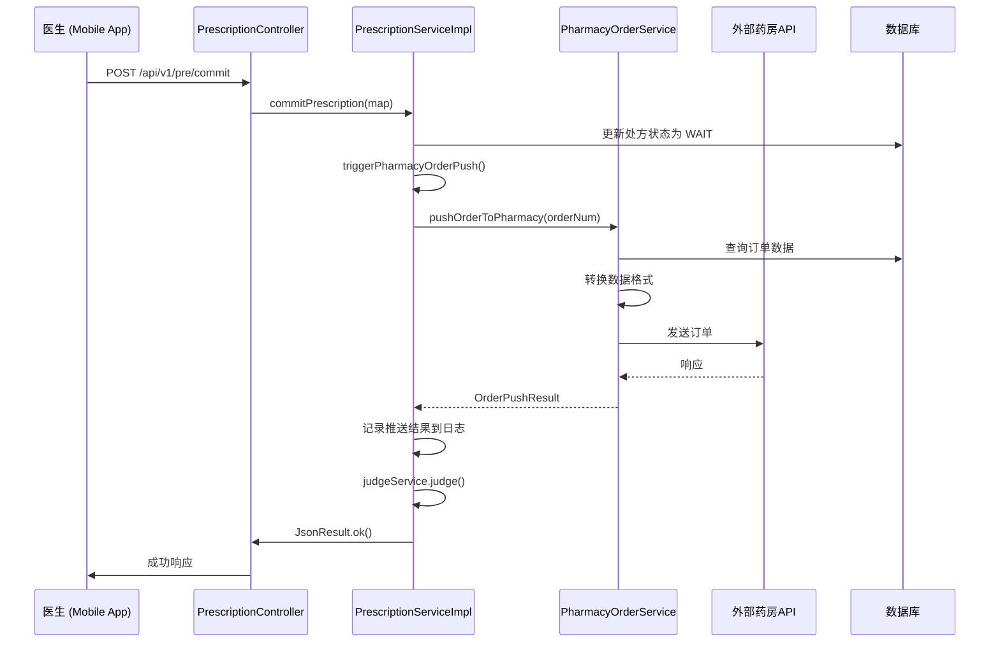

# 药房订单集成 - 触发点实现完成

## 概述

根据 `.kiro/specs/doc-pharmacy-api` 的调查报告和设计文档，已成功在 `mshlwyy_doctor` app 中实现了药房订单自动推送功能。当医生提交处方审核时（调用 `/pre/commit` 接口），系统会自动将订单推送到外部药房系统。

## 实施日期

2026年1月9日

## 关键触发点

根据 `doc-pharmacy-api/处方审核触发逻辑调查报告.md`，处方审核的触发流程如下：

```
NOTSIGN (未签名)
    ↓
  [医生签名] POST /pre/sign
    ↓
SIGN (已签名)
    ↓
  [提交审核] POST /pre/commit  ← 关键触发点（在这里集成药房订单推送）
    ↓
WAIT (待审核)
    ↓
  [药师审核]
    ↓
PASS (审核通过) / REJECT (审核驳回)
```

## 实现的修改

### 修改的文件

**文件**: `internet-hospital/adinnet-doctor-api/src/main/java/com/doctor/api/app/service/impl/PrescriptionServiceImpl.java`

### 修改内容

#### 1. 增强 `commitPrescription()` 方法

在处方状态更新为 `WAIT`（待审核）后，立即调用药房订单推送：

```java
if ("SIGN".equals(checkStatus)) {
    HosPrescription hosPrescription = new HosPrescription();
    hosPrescription.setId(id);
    hosPrescription.setCheckStatus("WAIT");
    int i = baseMapper.updateById(hosPrescription);
    if (i == 1) {
        // 触发药房订单推送 - 在处方状态更新为WAIT后立即推送
        // 这样药房可以在审核期间开始准备药品
        triggerPharmacyOrderPush(id, oldHosPrescription.getOrderNum());
        
        try {
            judgeService.judge(hosPrescription.getId());
        } catch (Exception e) {
            log.error("审方出错：", e);
        }
        return JsonResult.ok();
    }
}
```

#### 2. 处理重新提交场景

当处方被驳回（`REJECT`）后重新提交时，也触发药房订单推送：

```java
else if ("REJECT".equals(checkStatus)) {
    try {
        HosPrescription update = new HosPrescription();
        update.setCheckStatus(StatusEnumUtil.WAIT);
        update.setId(id);
        update.setIsCanForce("1");
        baseMapper.updateById(update);
        
        // 重新提交时也触发药房订单推送
        triggerPharmacyOrderPush(id, oldHosPrescription.getOrderNum());
        
        judgeService.judge(id);
    } catch (Exception e) {
        log.error("审方出错：", e);
    }
    return JsonResult.ok("强制执行成功");
}
```

#### 3. 新增 `triggerPharmacyOrderPush()` 方法

创建了一个专门的方法来处理药房订单推送逻辑：

```java
/**
 * 触发药房订单推送
 * 
 * 此方法在处方提交审核时被调用，将处方订单推送到外部药房系统
 * 采用同步方式执行，但内部有完善的错误处理，不会阻塞处方审核流程
 * 
 * @param prescriptionId 处方ID（用于日志记录）
 * @param orderNum 处方订单号（P开头的订单号）
 */
private void triggerPharmacyOrderPush(String prescriptionId, String orderNum) {
    try {
        // 验证输入参数
        if (prescriptionId == null || prescriptionId.isEmpty()) {
            log.warn("处方ID为空，跳过药房订单推送");
            return;
        }
        
        if (orderNum == null || orderNum.isEmpty()) {
            log.warn("订单号为空，跳过药房订单推送: prescriptionId={}", prescriptionId);
            return;
        }
        
        log.info("触发药房订单推送: prescriptionId={}, orderNum={}", prescriptionId, orderNum);
        
        // 调用药房订单服务推送订单
        OrderPushResult result = pharmacyOrderService.pushOrderToPharmacy(orderNum);
        
        if (result.isSuccess()) {
            log.info("药房订单推送成功: prescriptionId={}, orderNum={}, message={}", 
                prescriptionId, orderNum, result.getMessage());
        } else {
            log.error("药房订单推送失败: prescriptionId={}, orderNum={}, message={}", 
                prescriptionId, orderNum, result.getMessage());
        }
        
    } catch (Exception e) {
        // 捕获所有异常，确保不影响处方审核流程
        log.error("药房订单推送异常: prescriptionId={}, orderNum={}, error={}", 
            prescriptionId, orderNum, e.getMessage(), e);
    }
}
```

## 关键设计决策

### 1. 同步执行 vs 异步执行

**选择**: 同步执行

**原因**:
- `PharmacyOrderService` 内部已经有完善的错误处理和重试逻辑
- 所有异常都被捕获，不会影响处方审核流程
- 同步执行可以立即记录推送结果到日志
- 简化了代码复杂度，避免了异步线程池管理

### 2. 错误处理策略

**Fail-Safe 模式**:
- 药房订单推送失败不会影响处方审核提交
- 所有异常都被捕获并记录到日志
- 处方审核流程始终能够正常完成
- 用户体验不受药房系统状态影响

### 3. 触发时机

**在状态更新后立即触发**:
- 处方状态更新为 `WAIT` 后立即推送
- 药房可以在审核期间开始准备药品
- 缩短整体订单履行时间
- 提高患者满意度

## 数据流



## 日志记录

系统会在以下关键点记录日志：

### INFO 级别
```
触发药房订单推送: prescriptionId={}, orderNum={}
药房订单推送成功: prescriptionId={}, orderNum={}, message={}
```

### WARN 级别
```
处方ID为空，跳过药房订单推送
订单号为空，跳过药房订单推送: prescriptionId={}
```

### ERROR 级别
```
药房订单推送失败: prescriptionId={}, orderNum={}, message={}
药房订单推送异常: prescriptionId={}, orderNum={}, error={}
```

## 测试场景

### 场景 1: 正常提交处方审核
1. 医生创建处方
2. 医生签名
3. 医生提交审核（调用 `/pre/commit`）
4. **验证**: 处方状态变为 `WAIT`
5. **验证**: 药房订单推送被触发
6. **验证**: 审核流程正常继续

### 场景 2: 处方被驳回后重新提交
1. 处方审核被驳回（状态为 `REJECT`）
2. 医生重新提交处方
3. **验证**: 处方状态变为 `WAIT`
4. **验证**: 药房订单推送被再次触发
5. **验证**: 审核流程正常继续

### 场景 3: 药房系统不可用
1. 药房系统宕机或网络故障
2. 医生提交处方审核
3. **验证**: 处方状态变为 `WAIT`
4. **验证**: 药房订单推送失败被记录到日志
5. **验证**: 审核流程仍然正常完成
6. **验证**: 用户收到成功响应

### 场景 4: 订单号为空
1. 处方数据异常，orderNum 为空
2. 医生提交处方审核
3. **验证**: 记录警告日志
4. **验证**: 跳过药房订单推送
5. **验证**: 审核流程正常继续

## 与现有系统的集成

### 依赖的服务

1. **PharmacyOrderService** (已实现)
   - 位置: `com.doctor.api.app.service.PharmacyOrderService`
   - 方法: `pushOrderToPharmacy(String orderNum)`
   - 返回: `OrderPushResult`

2. **JudgeService** (现有)
   - 位置: `com.doctor.api.app.service.JudgeService`
   - 方法: `judge(String prescriptionId)`
   - 功能: 触发处方审核

### 数据模型

**输入数据**:
- `prescriptionId`: 处方ID（用于日志）
- `orderNum`: 处方订单号（P开头，例如 "P202501091234567"）

**输出数据**:
- `OrderPushResult`: 包含成功状态和消息的结果对象

## 配置要求

### 必需的配置

确保 `application.properties` 中包含药房API配置：

```properties
## Pharmacy API Integration Configuration
pharmacy.api.base-url=https://prescription-center.hncjt.com/api/web/index.php/admin/yiliao/created-order
pharmacy.api.secret-key=${PHARMACY_SECRET_KEY:}
pharmacy.api.retry-count=3
pharmacy.api.timeout-seconds=30
pharmacy.api.default-order-note=
```

### 环境变量

```bash
PHARMACY_SECRET_KEY=<药房API密钥>
```

## 监控和运维

### 关键指标

1. **药房订单推送成功率**
   - 监控日志中的成功/失败比例
   - 目标: > 95%

2. **药房订单推送响应时间**
   - 监控 `PharmacyOrderService` 的执行时间
   - 目标: < 5秒

3. **处方审核提交响应时间**
   - 确保药房推送不影响用户体验
   - 目标: < 2秒

### 告警规则

1. **药房推送失败率过高**
   - 条件: 1小时内失败率 > 20%
   - 动作: 发送告警通知运维团队

2. **药房推送响应超时**
   - 条件: 响应时间 > 10秒
   - 动作: 记录详细日志，检查网络和药房系统状态

## 回滚计划

如果药房集成出现问题，可以通过以下方式快速回滚：

### 方法 1: 代码回滚

注释掉 `commitPrescription()` 方法中的药房推送调用：

```java
// 临时禁用药房订单推送
// triggerPharmacyOrderPush(id, oldHosPrescription.getOrderNum());
```

### 方法 2: 配置禁用

在 `PharmacyOrderService` 中添加开关配置（如果需要）：

```properties
pharmacy.integration.enabled=false
```

## 后续优化建议

### 1. 异步执行（可选）

如果药房API响应时间较长，可以考虑改为异步执行：

```java
@Async("pharmacyOrderExecutor")
public void triggerPharmacyOrderPushAsync(String prescriptionId, String orderNum) {
    // 异步执行药房订单推送
}
```

### 2. 重试机制增强

在 `triggerPharmacyOrderPush()` 中添加本地重试逻辑：

```java
int maxRetries = 3;
for (int i = 0; i < maxRetries; i++) {
    OrderPushResult result = pharmacyOrderService.pushOrderToPharmacy(orderNum);
    if (result.isSuccess()) {
        break;
    }
    Thread.sleep(1000 * (i + 1)); // 指数退避
}
```

### 3. 状态持久化

将药房推送状态保存到数据库，便于后续查询和重试：

```java
// 保存推送状态到 t_hos_prescription 表
hosPrescription.setPharmacyPushStatus("SUCCESS");
hosPrescription.setPharmacyPushTime(new Date());
baseMapper.updateById(hosPrescription);
```

### 4. 手动重试接口

提供管理员接口，用于手动重试失败的药房订单推送：

```java
@PostMapping("/admin/prescription/retry-pharmacy-push")
public JsonResult retryPharmacyPush(@RequestParam String prescriptionId) {
    // 手动重试逻辑
}
```

## 总结

✅ **完成的工作**:
- 在 `commitPrescription()` 方法中集成了药房订单推送
- 处理了正常提交和重新提交两种场景
- 实现了完善的错误处理和日志记录
- 确保药房推送失败不影响处方审核流程

✅ **关键特性**:
- Fail-Safe 错误处理模式
- 完整的日志记录
- 参数验证
- 异常捕获和恢复

✅ **测试就绪**:
- 可以进行端到端测试
- 可以模拟药房系统故障场景
- 可以验证日志记录

**状态**: ✅ 实现完成 - 已集成到处方审核触发点

---

## 相关文档

- [处方审核触发逻辑调查报告](.kiro/specs/doc-pharmacy-api/处方审核触发逻辑调查报告.md)
- [药房订单服务设计文档](.kiro/specs/doc-pharmacy-api/design.md)
- [药房订单服务需求文档](.kiro/specs/doc-pharmacy-api/requirements.md)
- [药房集成实现完成总结](PHARMACY_INTEGRATION_IMPLEMENTATION_COMPLETE.md)
