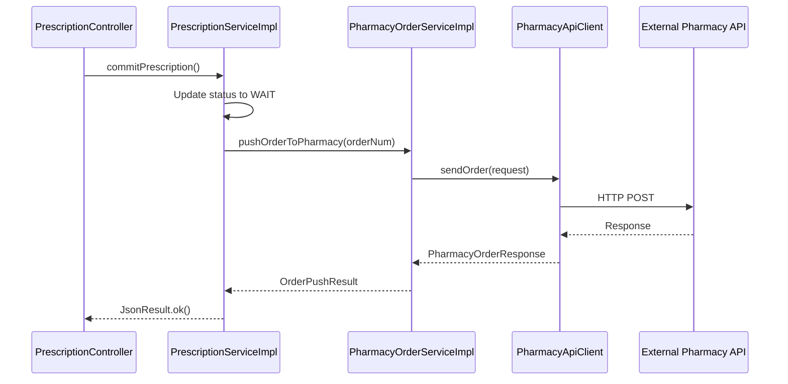
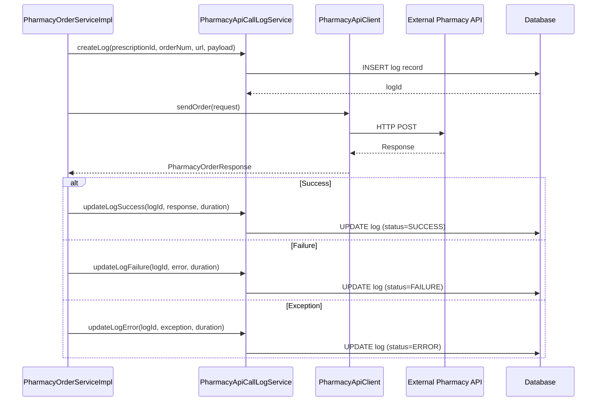

# Design Document: Pharmacy API Call Logging

## Overview

This design document specifies the addition of comprehensive API call logging to the existing pharmacy order integration in `internet-hospital/adinnet-doctor-api`. The pharmacy integration is already functional - prescriptions trigger pharmacy orders via `PharmacyOrderService` when submitted for audit. This enhancement adds detailed logging of all API calls to a database table for auditing, troubleshooting, and performance analysis.

**Current Status**: 
- ✅ Pharmacy integration is implemented in `PharmacyOrderServiceImpl`
- ✅ Prescription audit triggers pharmacy order push via `/pre/commit` endpoint
- ❌ API call logging to database is NOT implemented (only console logging exists)

**This Design Adds**:
- Database table for API call logs
- Entity and mapper for log persistence
- Service layer for log management
- Integration into existing `PharmacyOrderServiceImpl`

## Architecture

### Current Flow (Without Logging)



### Enhanced Flow (With Logging)



## Components

### 1. Database Table: t_pharmacy_api_call_log

**Location**: Already created at `internet-hospital/sql/t_pharmacy_api_call_log.sql`

**Schema**:
```sql
CREATE TABLE `t_pharmacy_api_call_log` (
  `id` VARCHAR(64) NOT NULL COMMENT '主键ID',
  `prescription_id` VARCHAR(64) DEFAULT NULL COMMENT '处方ID',
  `order_num` VARCHAR(64) DEFAULT NULL COMMENT '订单号',
  `request_url` VARCHAR(500) DEFAULT NULL COMMENT '请求URL',
  `request_method` VARCHAR(10) DEFAULT 'POST' COMMENT '请求方法',
  `request_payload` TEXT COMMENT '请求体(JSON)',
  `response_payload` TEXT COMMENT '响应体(JSON)',
  `request_time` DATETIME DEFAULT NULL COMMENT '请求时间',
  `response_time` DATETIME DEFAULT NULL COMMENT '响应时间',
  `duration` BIGINT DEFAULT NULL COMMENT '请求耗时(毫秒)',
  `http_status_code` INT DEFAULT NULL COMMENT 'HTTP状态码',
  `call_status` VARCHAR(20) DEFAULT NULL COMMENT '调用状态: SUCCESS, FAILURE, ERROR',
  `error_code` VARCHAR(50) DEFAULT NULL COMMENT '错误码',
  `error_message` VARCHAR(1000) DEFAULT NULL COMMENT '错误信息',
  `exception_type` VARCHAR(200) DEFAULT NULL COMMENT '异常类型',
  `exception_message` VARCHAR(2000) DEFAULT NULL COMMENT '异常信息',
  `create_time` DATETIME DEFAULT CURRENT_TIMESTAMP COMMENT '创建时间',
  PRIMARY KEY (`id`),
  KEY `idx_prescription_id` (`prescription_id`),
  KEY `idx_order_num` (`order_num`),
  KEY `idx_request_time` (`request_time`),
  KEY `idx_call_status` (`call_status`)
) ENGINE=InnoDB DEFAULT CHARSET=utf8mb4 COMMENT='药房API调用日志表';
```

### 2. Entity: PharmacyApiCallLog

**Location**: `internet-hospital/adinnet-doctor-api/src/main/java/com/doctor/api/app/entity/PharmacyApiCallLog.java` (NEW)

```java
package com.doctor.api.app.entity;

import com.baomidou.mybatisplus.annotation.IdType;
import com.baomidou.mybatisplus.annotation.TableId;
import com.baomidou.mybatisplus.annotation.TableName;
import lombok.Data;

import java.time.LocalDateTime;

@Data
@TableName("t_pharmacy_api_call_log")
public class PharmacyApiCallLog {
    @TableId(type = IdType.ASSIGN_UUID)
    private String id;
    
    private String prescriptionId;
    private String orderNum;
    private String requestUrl;
    private String requestMethod;
    private String requestPayload;
    private String responsePayload;
    private LocalDateTime requestTime;
    private LocalDateTime responseTime;
    private Long duration;
    private Integer httpStatusCode;
    private String callStatus;  // SUCCESS, FAILURE, ERROR
    private String errorCode;
    private String errorMessage;
    private String exceptionType;
    private String exceptionMessage;
    private LocalDateTime createTime;
}
```

### 3. Mapper: PharmacyApiCallLogMapper

**Location**: `internet-hospital/adinnet-doctor-api/src/main/java/com/doctor/api/app/mapper/PharmacyApiCallLogMapper.java` (NEW)

```java
package com.doctor.api.app.mapper;

import com.baomidou.mybatisplus.core.mapper.BaseMapper;
import com.doctor.api.app.entity.PharmacyApiCallLog;
import org.apache.ibatis.annotations.Mapper;

@Mapper
public interface PharmacyApiCallLogMapper extends BaseMapper<PharmacyApiCallLog> {
}
```

### 4. Service: PharmacyApiCallLogService

**Location**: `internet-hospital/adinnet-doctor-api/src/main/java/com/doctor/api/app/service/PharmacyApiCallLogService.java` (NEW)

```java
package com.doctor.api.app.service;

import com.doctor.api.app.entity.PharmacyApiCallLog;

public interface PharmacyApiCallLogService {
    
    /**
     * Create initial log record before API call
     */
    PharmacyApiCallLog createLog(String prescriptionId, String orderNum, String requestUrl, String requestPayload);
    
    /**
     * Update log record after successful API call
     */
    void updateLogSuccess(String logId, String responsePayload, int httpStatusCode, long duration);
    
    /**
     * Update log record after failed API call
     */
    void updateLogFailure(String logId, String responsePayload, int httpStatusCode, 
                          String errorCode, String errorMessage, long duration);
    
    /**
     * Update log record after exception
     */
    void updateLogError(String logId, Exception exception, long duration);
}
```

### 5. Service Implementation: PharmacyApiCallLogServiceImpl

**Location**: `internet-hospital/adinnet-doctor-api/src/main/java/com/doctor/api/app/service/impl/PharmacyApiCallLogServiceImpl.java` (NEW)

```java
package com.doctor.api.app.service.impl;

import com.doctor.api.app.entity.PharmacyApiCallLog;
import com.doctor.api.app.mapper.PharmacyApiCallLogMapper;
import com.doctor.api.app.service.PharmacyApiCallLogService;
import org.springframework.beans.factory.annotation.Autowired;
import org.springframework.stereotype.Service;

import java.time.LocalDateTime;

@Service
public class PharmacyApiCallLogServiceImpl implements PharmacyApiCallLogService {
    
    @Autowired
    private PharmacyApiCallLogMapper mapper;
    
    @Override
    public PharmacyApiCallLog createLog(String prescriptionId, String orderNum, 
                                        String requestUrl, String requestPayload) {
        PharmacyApiCallLog log = new PharmacyApiCallLog();
        log.setPrescriptionId(prescriptionId);
        log.setOrderNum(orderNum);
        log.setRequestUrl(requestUrl);
        log.setRequestMethod("POST");
        log.setRequestPayload(requestPayload);
        log.setRequestTime(LocalDateTime.now());
        log.setCallStatus("PENDING");
        
        mapper.insert(log);
        return log;
    }
    
    @Override
    public void updateLogSuccess(String logId, String responsePayload, 
                                 int httpStatusCode, long duration) {
        PharmacyApiCallLog log = new PharmacyApiCallLog();
        log.setId(logId);
        log.setResponsePayload(responsePayload);
        log.setResponseTime(LocalDateTime.now());
        log.setHttpStatusCode(httpStatusCode);
        log.setDuration(duration);
        log.setCallStatus("SUCCESS");
        
        mapper.updateById(log);
    }
    
    @Override
    public void updateLogFailure(String logId, String responsePayload, int httpStatusCode,
                                 String errorCode, String errorMessage, long duration) {
        PharmacyApiCallLog log = new PharmacyApiCallLog();
        log.setId(logId);
        log.setResponsePayload(responsePayload);
        log.setResponseTime(LocalDateTime.now());
        log.setHttpStatusCode(httpStatusCode);
        log.setDuration(duration);
        log.setCallStatus("FAILURE");
        log.setErrorCode(errorCode);
        log.setErrorMessage(errorMessage);
        
        mapper.updateById(log);
    }
    
    @Override
    public void updateLogError(String logId, Exception exception, long duration) {
        PharmacyApiCallLog log = new PharmacyApiCallLog();
        log.setId(logId);
        log.setResponseTime(LocalDateTime.now());
        log.setDuration(duration);
        log.setCallStatus("ERROR");
        log.setExceptionType(exception.getClass().getName());
        log.setExceptionMessage(exception.getMessage());
        
        mapper.updateById(log);
    }
}
```

### 6. Enhanced PharmacyOrderServiceImpl

**Location**: `internet-hospital/adinnet-doctor-api/src/main/java/com/doctor/api/app/service/impl/PharmacyOrderServiceImpl.java` (MODIFY)

**Changes**:
1. Inject `PharmacyApiCallLogService`
2. Create log before API call
3. Update log after API call (success/failure/error)
4. Get prescription ID from `OrderMainInfo`

**Key Code Changes**:
```java
@Autowired
private PharmacyApiCallLogService apiCallLogService;

@Override
public OrderPushResult pushOrderToPharmacy(String orderNum) {
    long startTime = System.currentTimeMillis();
    PharmacyApiCallLog apiLog = null;
    String prescriptionId = null;
    
    try {
        // Retrieve order data
        OrderMainInfo mainInfo = orderMainInfoMapper.getOrderMainInfo(orderNum);
        prescriptionId = mainInfo.getPrescriptionId();  // Get prescription ID
        
        // ... existing validation and transformation code ...
        
        // Create API call log BEFORE sending request
        String requestUrl = pharmacyApiClient.getApiUrl();
        String requestPayload = JSON.toJSONString(request);
        apiLog = apiCallLogService.createLog(prescriptionId, orderNum, requestUrl, requestPayload);
        
        // Send to pharmacy API
        PharmacyOrderResponse apiResponse = pharmacyApiClient.sendOrder(request);
        
        // Update log based on response
        long duration = System.currentTimeMillis() - startTime;
        String responsePayload = JSON.toJSONString(apiResponse);
        
        if (apiResponse != null && apiResponse.isSuccess()) {
            apiCallLogService.updateLogSuccess(apiLog.getId(), responsePayload, 200, duration);
            // ... existing success handling ...
        } else {
            String errorCode = apiResponse != null ? String.valueOf(apiResponse.getErrorCode()) : "UNKNOWN";
            String errorMsg = apiResponse != null ? apiResponse.getErrorMsg() : "Unknown error";
            apiCallLogService.updateLogFailure(apiLog.getId(), responsePayload, 200, errorCode, errorMsg, duration);
            // ... existing failure handling ...
        }
        
    } catch (Exception e) {
        long duration = System.currentTimeMillis() - startTime;
        if (apiLog != null) {
            apiCallLogService.updateLogError(apiLog.getId(), e, duration);
        }
        // ... existing exception handling ...
    }
}
```

## Data Flow

### 1. Create Log (Before API Call)
```
PharmacyOrderServiceImpl
  → PharmacyApiCallLogService.createLog()
    → INSERT INTO t_pharmacy_api_call_log
      (id, prescription_id, order_num, request_url, request_payload, request_time, call_status='PENDING')
  ← Return PharmacyApiCallLog with generated ID
```

### 2. Update Log Success
```
PharmacyOrderServiceImpl
  → PharmacyApiCallLogService.updateLogSuccess()
    → UPDATE t_pharmacy_api_call_log
      SET response_payload=?, response_time=?, http_status_code=?, duration=?, call_status='SUCCESS'
      WHERE id=?
```

### 3. Update Log Failure
```
PharmacyOrderServiceImpl
  → PharmacyApiCallLogService.updateLogFailure()
    → UPDATE t_pharmacy_api_call_log
      SET response_payload=?, response_time=?, http_status_code=?, duration=?, 
          call_status='FAILURE', error_code=?, error_message=?
      WHERE id=?
```

### 4. Update Log Error
```
PharmacyOrderServiceImpl
  → PharmacyApiCallLogService.updateLogError()
    → UPDATE t_pharmacy_api_call_log
      SET response_time=?, duration=?, call_status='ERROR', 
          exception_type=?, exception_message=?
      WHERE id=?
```

## Error Handling

All logging operations are wrapped in try-catch blocks to ensure that logging failures do not affect the main pharmacy order push workflow.

## Testing Strategy

### Unit Tests
1. Test `PharmacyApiCallLogServiceImpl` methods
2. Test log creation with valid data
3. Test log updates for success/failure/error scenarios

### Integration Tests
1. Test end-to-end pharmacy order push with logging
2. Verify log records are created in database
3. Verify log records contain correct data

## Deployment

1. Run SQL script to create `t_pharmacy_api_call_log` table
2. Deploy updated code with new entity, mapper, and service classes
3. Verify logging is working in development environment
4. Deploy to production

## Summary

This design adds comprehensive API call logging to the existing pharmacy integration without changing the core functionality. All pharmacy API calls will be logged to the database for auditing, troubleshooting, and performance analysis.
