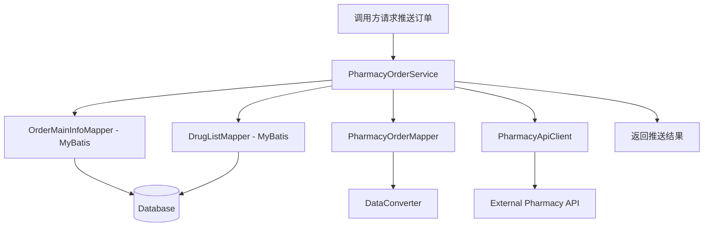

# Design Document

## Overview

本设计文档描述了在 **adinnet-patient-api** 模块中实现药房订单推送功能的技术方案。该功能将复制 doctor-api 中已实现的药房订单推送逻辑，使患者端应用也能够将处方订单推送到外部药房系统。

设计遵循分层架构，清晰分离数据访问、业务逻辑和外部集成关注点。系统优先考虑数据完整性、错误处理和性能优化。集成遵循失败安全模式，药房推送失败不会影响主业务流程。

## Architecture

### 模块结构

药房集成将在 **adinnet-patient-api** 模块中实现，包结构如下：

```
adinnet-patient-api/
└── src/main/java/com/patient/api/
    ├── app/
    │   ├── service/
    │   │   └── pharmacy/
    │   │       ├── PharmacyOrderService.java          (服务接口)
    │   │       └── impl/
    │   │           └── PharmacyOrderServiceImpl.java  (服务实现)
    │   ├── mapper/
    │   │   └── pharmacy/
    │   │       ├── PharmacyOrderMapper.java           (数据转换)
    │   │       ├── OrderMainInfoMapper.java           (MyBatis mapper)
    │   │       └── DrugListMapper.java                (MyBatis mapper)
    │   └── model/
    │       └── pharmacy/
    │           ├── request/
    │           │   ├── PharmacyOrderRequest.java
    │           │   ├── OrderInfo.java
    │           │   ├── GoodsItem.java
    │           │   ├── ContactInfo.java
    │           │   └── PrescriptionInfo.java
    │           ├── response/
    │           │   └── PharmacyOrderResponse.java
    │           └── internal/
    │               ├── OrderMainInfo.java
    │               ├── DrugInfo.java
    │               └── OrderPushResult.java
    └── common/
        ├── pharmacy/
        │   ├── DataConverter.java                     (数据类型转换)
        │   └── PharmacyApiClient.java                 (HTTP客户端)
        └── config/
            └── PharmacyConfig.java                    (配置属性)
```

### 高层架构



### 组件层次

1. **服务层**: 协调订单处理工作流
2. **数据访问层**: MyBatis mappers 用于优化查询
3. **转换层**: 在内部和外部格式之间映射和转换数据
4. **集成层**: 处理与药房 API 的 HTTP 通信
5. **横切关注点**: 日志、配置、错误处理

## Components and Interfaces

### 1. PharmacyOrderService

主要编排服务，协调订单推送工作流。

```java
package com.patient.api.app.service.pharmacy;

import com.patient.api.app.model.pharmacy.internal.OrderPushResult;

/**
 * 药房订单集成服务
 * 处理将处方药品订单推送到外部药房系统
 */
public interface PharmacyOrderService {
    
    /**
     * 处理并推送订单到药房系统
     * 
     * @param orderNum 要处理的订单号
     * @return 处理结果，包含状态和消息
     */
    OrderPushResult pushOrderToPharmacy(String orderNum);
}
```

### 2. PharmacyOrderServiceImpl

服务实现类，包含完整的业务逻辑。

```java
package com.patient.api.app.service.pharmacy.impl;

@Service
public class PharmacyOrderServiceImpl implements PharmacyOrderService {
    
    @Autowired
    private OrderMainInfoMapper orderMainInfoMapper;
    
    @Autowired
    private DrugListMapper drugListMapper;
    
    @Autowired
    private PharmacyOrderMapper pharmacyOrderMapper;
    
    @Autowired
    private PharmacyApiClient pharmacyApiClient;
    
    @Override
    public OrderPushResult pushOrderToPharmacy(String orderNum) {
        // 1. 检索订单数据
        // 2. 验证必填字段
        // 3. 转换数据格式
        // 4. 发送到药房 API
        // 5. 处理响应并返回结果
    }
}
```

### 3. MyBatis Mappers

数据检索的 MyBatis mapper 接口。

```java
package com.patient.api.app.mapper.pharmacy;

@Mapper
public interface OrderMainInfoMapper {
    /**
     * 检索订单主要信息（订单、处方、患者、医生）
     * 使用单个查询和 LEFT JOINs
     */
    OrderMainInfo getOrderMainInfo(@Param("orderNum") String orderNum);
}

@Mapper
public interface DrugListMapper {
    /**
     * 检索订单的药品列表
     * 单独查询以避免笛卡尔积
     */
    List<DrugInfo> getDrugList(@Param("orderNum") String orderNum);
}
```

### 4. PharmacyOrderMapper

将内部数据结构转换为药房 API 格式。

```java
package com.patient.api.app.mapper.pharmacy;

@Component
public class PharmacyOrderMapper {
    
    @Autowired
    private DataConverter dataConverter;
    
    /**
     * 将内部订单数据映射到药房 API 请求格式
     */
    public PharmacyOrderRequest mapToPharmacyOrder(
        OrderMainInfo mainInfo, 
        List<DrugInfo> drugList) {
        // 构建 OrderInfo
        // 构建 GoodsList
        // 构建 ContactInfo
        // 构建 PrescriptionInfo
    }
}
```

### 5. DataConverter

处理所有数据类型转换。

```java
package com.patient.api.common.pharmacy;

@Component
public class DataConverter {
    
    /**
     * 将元转换为分
     * @param yuanAmount 元金额字符串
     * @return 分金额整数
     */
    public Integer convertYuanToFen(String yuanAmount);
    
    /**
     * 转换性别代码
     * @param internalSex "1" 男, "0" 女
     * @return "m" 男, "f" 女
     */
    public String convertSex(String internalSex);
    
    /**
     * 转换数量字符串为整数
     */
    public Integer convertQuantity(String quantity);
    
    /**
     * 格式化生日为 YYYY-MM-DD
     */
    public String formatBirthday(String birthday);
}
```

### 6. PharmacyApiClient

处理与药房 API 的 HTTP 通信。

```java
package com.patient.api.common.pharmacy;

@Component
public class PharmacyApiClient {
    
    @Autowired
    private RestTemplate restTemplate;
    
    @Autowired
    private PharmacyConfig pharmacyConfig;
    
    /**
     * 发送订单到药房 API，带重试逻辑
     * @param request 药房订单请求
     * @return API 响应
     */
    public PharmacyOrderResponse sendOrder(PharmacyOrderRequest request);
    
    /**
     * 获取完整的 API URL
     */
    public String getApiUrl();
}
```

### 7. PharmacyConfig

配置属性类。

```java
package com.patient.api.common.config;

@Configuration
@ConfigurationProperties(prefix = "pharmacy.api")
public class PharmacyConfig {
    private String baseUrl;
    private String secretKey;
    private int retryCount = 3;
    private int timeoutSeconds = 30;
    private String defaultOrderNote = "";
    
    // Getters and setters
}
```

## Data Models

### 内部数据模型

```java
package com.patient.api.app.model.pharmacy.internal;

/**
 * 聚合的订单主要信息
 */
public class OrderMainInfo {
    // 订单字段
    private String orderNum;
    private String totalPrice;
    
    // 联系人字段
    private String name;
    private String mobile;
    private String province;
    private String city;
    private String district;
    private String address;
    
    // 处方字段
    private String prescriptionId;
    private String prescriptionNum;
    private String prescriptionImg;
    private String medicalCertificate;
    private String departName;
    
    // 患者字段
    private String prescriptionPatientName;
    private String prescriptionSex;
    private String prescriptionAge;
    private String prescriptionMobile;
    private String birthDay;
    
    // 医生字段
    private String doctorName;
    private String hospitalName;
}

/**
 * 药品信息
 */
public class DrugInfo {
    private String mshId;        // 药房系统药品ID
    private String number;       // 数量
    private String price;        // 单价（元）
    private String drugName;     // 药品名称
}

/**
 * 订单推送结果
 */
public class OrderPushResult {
    private boolean success;
    private String orderNum;
    private String message;
    private PharmacyOrderResponse apiResponse;
}
```

### 药房 API 模型

```java
package com.patient.api.app.model.pharmacy.request;

/**
 * 完整的药房订单请求
 */
public class PharmacyOrderRequest {
    @JsonProperty("order_info")
    private OrderInfo orderInfo;
    
    @JsonProperty("goods_list")
    private List<GoodsItem> goodsList;
    
    @JsonProperty("contact_info")
    private ContactInfo contactInfo;
    
    @JsonProperty("pres_info")
    private PrescriptionInfo presInfo;
}

/**
 * 订单信息部分
 */
public class OrderInfo {
    @JsonProperty("order_id")
    private String orderId;
    
    @JsonProperty("order_price_fen")
    private Integer orderPriceFen;
    
    @JsonProperty("order_origin_price_fen")
    private Integer orderOriginPriceFen;
    
    @JsonProperty("order_express_fen")
    private Integer orderExpressFen;
    
    private String notex;
}

/**
 * 商品项
 */
public class GoodsItem {
    @JsonProperty("goods_id")
    private String goodsId;
    
    private Integer num;
    
    @JsonProperty("origin_fen")
    private Integer originFen;
}

/**
 * 联系人信息
 */
public class ContactInfo {
    private String name;
    private String phone;
    private String province;
    private String city;
    private String country;  // 区/县
    private String address;
}

/**
 * 处方信息
 */
public class PrescriptionInfo {
    @JsonProperty("pres_no")
    private String presNo;
    
    @JsonProperty("pres_img_url")
    private String presImgUrl;
    
    @JsonProperty("patient_name")
    private String patientName;
    
    private String sex;
    private Integer age;
    
    @JsonProperty("phone_num")
    private String phoneNum;
    
    private String diagnosis;
    private String hospital;
    private String clinic;
    
    @JsonProperty("doctor_name")
    private String doctorName;
    
    private String birthday;
}
```

```java
package com.patient.api.app.model.pharmacy.response;

/**
 * 药房 API 响应
 */
public class PharmacyOrderResponse {
    @JsonProperty("error_code")
    private Integer errorCode;  // 0 = 成功, 1 = 失败
    
    @JsonProperty("error_msg")
    private String errorMsg;
    
    public boolean isSuccess() {
        return errorCode != null && errorCode == 0;
    }
}
```

## Database Query Strategy

### 查询 1: 订单主要信息

```sql
SELECT 
    hpdo.order_num,
    hp.total_price,
    hpdo.name,
    hpdo.mobile,
    hpdo.province,
    hpdo.city,
    hpdo.district,
    hpdo.address,
    hp.id as prescription_id,
    hp.prescription_num,
    hp.img as prescription_img,
    hp.medical_certificate,
    hp.depart_name,
    hp.name as prescription_patient_name,
    hp.sex as prescription_sex,
    hp.age as prescription_age,
    hp.mobile as prescription_mobile,
    pu.birth_day,
    du.name as doctor_name,
    du.hospital_name
FROM t_hos_pre_drug_order hpdo
LEFT JOIN t_hos_prescription hp ON hpdo.hos_prescription_id = hp.id
LEFT JOIN t_patient_user pu ON hp.patient_user_id = pu.id
LEFT JOIN t_doctor_user du ON hp.doctor_user_id = du.id
WHERE hpdo.order_num = #{orderNum}
```

### 查询 2: 药品列表

```sql
SELECT 
    d.msh_id,
    hpd.number,
    hpd.price,
    hpd.name as drug_name
FROM t_hos_pre_drug_order hpdo
INNER JOIN t_hos_prescription hp ON hpdo.hos_prescription_id = hp.id
INNER JOIN t_hos_prescription_drug hpd ON hp.id = hpd.hos_prescription_id
INNER JOIN t_drug d ON hpd.drug_id = d.id
WHERE hpdo.order_num = #{orderNum}
```

## Error Handling

### 错误类别

1. **数据验证错误**: 缺少必填字段、无效数据格式、数据转换失败
2. **数据库错误**: 连接失败、查询超时、数据未找到
3. **API 通信错误**: 网络超时、连接拒绝、无效响应格式
4. **业务逻辑错误**: 订单已推送、订单状态无效

### 重试逻辑

- API 通信错误: 最多重试 3 次，指数退避
- 数据库连接错误: 最多重试 2 次，1 秒延迟
- 数据验证错误: 不重试，记录日志
- 业务逻辑错误: 不重试，记录日志

## Correctness Properties

*A property is a characteristic or behavior that should hold true across all valid executions of a system-essentially, a formal statement about what the system should do. Properties serve as the bridge between human-readable specifications and machine-verifiable correctness guarantees.*

### Property 1: 数据检索完整性

*For any* valid order number, when the system retrieves order data, the returned OrderMainInfo SHALL contain all required fields (orderNum, totalPrice, name, mobile, province, city, district, address) if the order exists in the database.

**Validates: Requirements 1.1, 1.2, 1.3**

### Property 2: 必填字段验证

*For any* OrderMainInfo with missing required fields (orderNum, totalPrice, name, mobile, province, city, district, address), the validation SHALL return false and the push operation SHALL return a failure result.

**Validates: Requirements 1.3, 1.4**

### Property 3: 货币转换正确性

*For any* valid Yuan amount string, converting to Fen SHALL produce an integer value equal to the Yuan amount multiplied by 100, rounded to the nearest integer.

**Validates: Requirements 3.1, 3.2**

### Property 4: 性别代码转换

*For any* internal sex code, converting "1" SHALL produce "m" and converting "0" SHALL produce "f". Any other value SHALL produce null.

**Validates: Requirements 3.3, 3.4**

### Property 5: 字段映射完整性

*For any* valid OrderMainInfo and DrugInfo list, the mapped PharmacyOrderRequest SHALL contain:
- order_info.order_id equal to orderNum
- order_info.order_price_fen equal to totalPrice converted to Fen
- order_info.order_express_fen equal to 0
- contact_info fields mapped from corresponding OrderMainInfo fields
- goods_list with correct msh_id, num, and origin_fen for each drug

**Validates: Requirements 2.1, 2.2, 2.3, 2.4, 2.5, 2.9**

### Property 6: 可选字段处理

*For any* OrderMainInfo with null optional fields (prescriptionImg, birthDay, doctorName, hospitalName), the mapped PrescriptionInfo SHALL have corresponding fields set to null without causing errors.

**Validates: Requirements 4.1, 4.3, 4.4, 4.5**

### Property 7: API 响应处理

*For any* PharmacyOrderResponse with error_code 0, the OrderPushResult SHALL have success=true. For any response with error_code 1 or null response, the result SHALL have success=false.

**Validates: Requirements 5.5, 5.6**

### Property 8: 重试逻辑

*For any* API request that times out, the system SHALL retry up to 3 times before returning a failure result. After all retries fail, the result SHALL have success=false with appropriate error message.

**Validates: Requirements 5.7, 5.8**

### Property 9: 错误容错

*For any* exception during pharmacy order push, the system SHALL catch the exception, log the error, and return a failure result without throwing the exception to the caller.

**Validates: Requirements 10.1, 10.2, 10.3, 10.4**

## Testing Strategy

### 单元测试

1. **DataConverter 测试**
   - 测试元到分转换（各种小数位数）
   - 测试性别代码转换
   - 测试数量字符串到整数转换
   - 测试生日格式验证
   - 测试 null 和空字符串处理

2. **PharmacyOrderMapper 测试**
   - 测试完整数据的订单映射
   - 测试缺少可选字段的映射
   - 测试 null 值映射
   - 测试多药品的商品列表映射

3. **PharmacyOrderServiceImpl 测试**
   - Mock 数据库响应
   - 测试完整数据的数据检索
   - 测试缺少可选数据的数据检索
   - 测试数据库失败的错误处理

### 属性测试

使用 jqwik 进行属性测试，每个属性测试至少运行 100 次迭代。

1. **货币转换属性测试**
   - 生成随机元金额
   - 验证转换结果正确

2. **字段映射属性测试**
   - 生成随机 OrderMainInfo 和 DrugInfo
   - 验证映射结果包含所有必需字段

3. **验证属性测试**
   - 生成带有缺失字段的数据
   - 验证验证逻辑正确识别缺失字段

### 集成测试

1. **数据库集成测试**
   - 测试实际查询对测试数据库
   - 验证查询性能
   - 测试各种数据场景

2. **API 集成测试**
   - Mock 药房 API 响应
   - 测试成功的订单推送
   - 测试 API 错误响应
   - 测试重试逻辑
   - 测试超时处理

## Configuration

### Application Properties

配置将添加到 adinnet-patient-api 模块的 `application.properties`:

```properties
# Pharmacy API Configuration
pharmacy.api.base-url=https://prescription-center.hncjt.com/api/web/index.php/admin/yiliao/created-order
pharmacy.api.secret-key=${PHARMACY_SECRET_KEY}
pharmacy.api.retry-count=3
pharmacy.api.timeout-seconds=30
pharmacy.api.default-order-note=
```

### RestTemplate 配置

需要在 patient-api 中配置 RestTemplate Bean:

```java
@Configuration
public class RestTemplateConfig {
    
    @Bean
    public RestTemplate restTemplate() {
        return new RestTemplateBuilder()
            .setConnectTimeout(Duration.ofSeconds(30))
            .setReadTimeout(Duration.ofSeconds(30))
            .build();
    }
}
```

## Performance Considerations

1. **查询优化**
   - 使用分离查询避免笛卡尔积
   - 确保连接列上有适当的索引
   - 使用连接池

2. **监控**
   - 跟踪 API 响应时间
   - 监控成功/失败率
   - 高错误率时告警

## Security Considerations

1. **API 认证**
   - 将密钥存储在环境变量中
   - 永不记录密钥值
   - 定期轮换密钥

2. **数据隐私**
   - 仅记录必要信息
   - 在日志中掩码敏感患者数据
   - 使用 HTTPS 进行 API 通信

