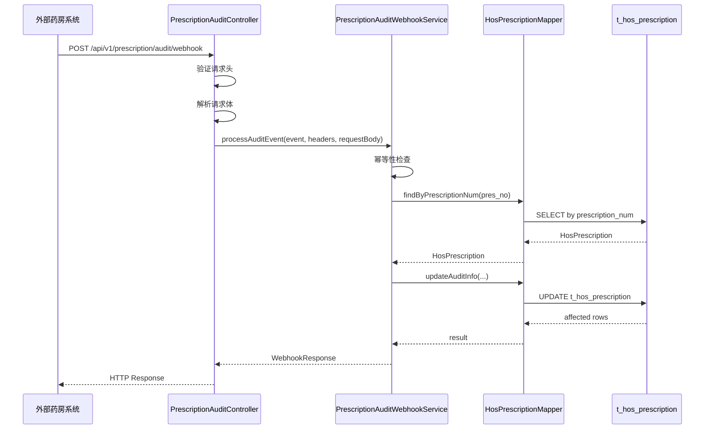

# Design Document: Prescription Audit Webhook

## Overview

本设计文档描述处方审核结果Webhook接收端口的技术实现方案。该接口用于接收外部药房系统（楚济堂）推送的处方审核结果（pres.audit事件），并更新本地`t_hos_prescription`表中对应处方记录的审核状态信息。

设计遵循现有`logistics/webhook`的架构模式，确保代码风格和结构的一致性。

## Architecture



## Components and Interfaces

### 1. Controller Layer

**PrescriptionAuditController** (`com.adinnet.admin.system.controller`)

```java
@RestController
@RequestMapping("/api/v1/prescription/audit")
public class PrescriptionAuditController {
    
    @PostMapping(value = "/webhook", 
                 consumes = MediaType.APPLICATION_JSON_VALUE,
                 produces = MediaType.APPLICATION_JSON_VALUE)
    public ResponseEntity<WebhookResponse> handleAuditWebhook(
            @RequestBody String requestBody,
            @RequestHeader(value = "X-App-Event", required = false) String appEvent,
            @RequestHeader(value = "X-App-Timestamp", required = false) String appTimestamp,
            @RequestHeader(value = "X-App-Signature", required = false) String appSignature,
            HttpServletRequest request);
}
```

### 2. Service Layer

**PrescriptionAuditWebhookService** (Interface)

```java
public interface PrescriptionAuditWebhookService {
    
    /**
     * 处理处方审核事件
     */
    WebhookResponse processAuditEvent(PrescriptionAuditEvent event, 
                                       WebhookHeaders headers, 
                                       String requestPayload);
    
    /**
     * 幂等性检查
     */
    boolean isEventProcessed(String eventId);
}
```

**PrescriptionAuditWebhookServiceImpl** (Implementation)

主要职责：
- 幂等性检查（基于event.id）
- 根据pres_no查找处方记录
- 更新处方审核信息
- 记录处理日志

### 3. Mapper Layer

**HosPrescriptionMapper** 扩展方法：

```java
/**
 * 根据处方编号查询处方记录
 */
HosPrescription selectByPrescriptionNum(@Param("prescriptionNum") String prescriptionNum);

/**
 * 更新处方审核信息
 */
int updateAuditInfo(@Param("prescriptionNum") String prescriptionNum,
                    @Param("img") String img,
                    @Param("checkTime") String checkTime,
                    @Param("checkStatus") String checkStatus,
                    @Param("checkContent") String checkContent,
                    @Param("checkReturn") String checkReturn,
                    @Param("checkPharmaceutist") String checkPharmaceutist);
```

**PrescriptionAuditWebhookLogMapper** (新增)：

```java
public interface PrescriptionAuditWebhookLogMapper extends BaseMapper<PrescriptionAuditWebhookLog> {
    
    /**
     * 根据事件ID查询日志记录（用于幂等性检查）
     */
    PrescriptionAuditWebhookLog selectByEventId(@Param("eventId") String eventId);
    
    /**
     * 插入日志记录
     */
    int insertLog(PrescriptionAuditWebhookLog log);
    
    /**
     * 更新日志记录（处理完成后更新响应信息）
     */
    int updateLog(@Param("id") Long id,
                  @Param("responsePayload") String responsePayload,
                  @Param("httpStatusCode") Integer httpStatusCode,
                  @Param("processStatus") String processStatus,
                  @Param("errorMessage") String errorMessage,
                  @Param("exceptionType") String exceptionType,
                  @Param("duration") Long duration);
}
```

### 4. Log Service Layer

**PrescriptionAuditWebhookLogService** (新增)：

```java
public interface PrescriptionAuditWebhookLogService {
    
    /**
     * 创建日志记录
     */
    Long createLog(PrescriptionAuditWebhookLog log);
    
    /**
     * 根据事件ID查询日志
     */
    PrescriptionAuditWebhookLog findByEventId(String eventId);
    
    /**
     * 更新日志记录
     */
    void updateLog(Long logId, String responsePayload, Integer httpStatusCode,
                   String processStatus, String errorMessage, String exceptionType, Long duration);
}
```

## Data Models

### 1. 请求事件模型

**PrescriptionAuditEvent** (`com.adinnet.admin.system.model.prescription`)

```java
@Data
public class PrescriptionAuditEvent implements Serializable {
    /**
     * 事件唯一ID
     * 格式：evt_pres_{pres_no}_{timestamp}
     */
    private String id;
    
    /**
     * 事件类型
     * 固定值：pres.audit
     */
    private String type;
    
    /**
     * Unix时间戳（秒）
     */
    private Long timestamp;
    
    /**
     * 事件数据
     */
    private PrescriptionAuditData data;
}
```

**PrescriptionAuditData**

```java
@Data
public class PrescriptionAuditData implements Serializable {
    /**
     * 处方单号（对应本地prescription_num）
     */
    @JsonProperty("pres_no")
    private String presNo;
    
    /**
     * 关联的订单号
     */
    @JsonProperty("order_id")
    private String orderId;
    
    /**
     * 处方图片地址
     */
    @JsonProperty("recipe_url")
    private String recipeUrl;
    
    /**
     * 审方状态：1-通过，2-驳回
     */
    private Integer status;
    
    /**
     * 审方消息
     */
    private String msg;
}
```

### 2. 字段映射关系

| 推送字段 | 本地字段 | 映射规则 |
|---------|---------|---------|
| `data.pres_no` | `prescription_num` | 用于查找记录 |
| `data.recipe_url` | `img` | 直接赋值 |
| `data.status` | `check_status` | 1→"PASS", 2→"REJECT" |
| `data.msg` | `check_content` | 直接赋值 |
| 完整请求体JSON | `check_return` | 存储原始JSON |
| 固定值"楚济堂" | `check_pharmaceutist` | 固定赋值 |
| 当前时间 | `check_time` | 系统当前时间 |

### 3. 状态映射

```java
public class AuditStatusMapper {
    public static String mapStatus(Integer status) {
        if (status == null) {
            return null;
        }
        switch (status) {
            case 1:
                return "PASS";
            case 2:
                return "REJECT";
            default:
                throw new IllegalArgumentException("Invalid status: " + status);
        }
    }
}
```

### 4. 日志表结构

**表名**: `t_prescription_audit_webhook_log`

```sql
CREATE TABLE IF NOT EXISTS `t_prescription_audit_webhook_log` (
  `id` BIGINT NOT NULL AUTO_INCREMENT COMMENT '主键ID',
  `event_id` VARCHAR(100) NOT NULL COMMENT '事件唯一ID，格式：evt_pres_{pres_no}_{timestamp}',
  `event_type` VARCHAR(50) DEFAULT NULL COMMENT '事件类型，固定值：pres.audit',
  `pres_no` VARCHAR(64) DEFAULT NULL COMMENT '处方单号（外部系统）',
  `order_id` VARCHAR(64) DEFAULT NULL COMMENT '关联订单号',
  `audit_status` INT DEFAULT NULL COMMENT '审核状态：1-通过，2-驳回',
  `audit_msg` VARCHAR(500) DEFAULT NULL COMMENT '审核消息',
  `recipe_url` VARCHAR(500) DEFAULT NULL COMMENT '处方图片地址',
  `request_payload` TEXT COMMENT '请求体 (JSON格式)',
  `request_headers` TEXT COMMENT '请求头 (JSON格式)',
  `response_payload` TEXT COMMENT '响应体 (JSON格式)',
  `request_time` DATETIME DEFAULT NULL COMMENT '请求时间',
  `response_time` DATETIME DEFAULT NULL COMMENT '响应时间',
  `duration` BIGINT DEFAULT NULL COMMENT '处理耗时 (毫秒)',
  `http_status_code` INT DEFAULT NULL COMMENT 'HTTP状态码',
  `process_status` VARCHAR(20) DEFAULT NULL COMMENT '处理状态: SUCCESS-成功, FAILURE-失败, ERROR-异常',
  `error_message` VARCHAR(2000) DEFAULT NULL COMMENT '错误信息',
  `exception_type` VARCHAR(200) DEFAULT NULL COMMENT '异常类型',
  `client_ip` VARCHAR(50) DEFAULT NULL COMMENT '客户端IP地址',
  `create_time` DATETIME DEFAULT CURRENT_TIMESTAMP COMMENT '创建时间',
  `update_time` DATETIME DEFAULT CURRENT_TIMESTAMP ON UPDATE CURRENT_TIMESTAMP COMMENT '更新时间',
  PRIMARY KEY (`id`),
  UNIQUE KEY `uk_event_id` (`event_id`) COMMENT '事件ID唯一索引，用于幂等性检查',
  KEY `idx_pres_no` (`pres_no`) COMMENT '处方单号索引',
  KEY `idx_request_time` (`request_time`) COMMENT '请求时间索引',
  KEY `idx_process_status` (`process_status`) COMMENT '处理状态索引'
) ENGINE=InnoDB DEFAULT CHARSET=utf8mb4 COMMENT='处方审核Webhook调用日志表';
```

### 5. 日志实体类

**PrescriptionAuditWebhookLog** (`com.adinnet.admin.system.model.prescription`)

```java
@Data
@TableName("t_prescription_audit_webhook_log")
public class PrescriptionAuditWebhookLog implements Serializable {
    
    private static final long serialVersionUID = 1L;
    
    public static final String STATUS_SUCCESS = "SUCCESS";
    public static final String STATUS_FAILURE = "FAILURE";
    public static final String STATUS_ERROR = "ERROR";
    
    @TableId(value = "id", type = IdType.AUTO)
    private Long id;
    
    private String eventId;
    private String eventType;
    private String presNo;
    private String orderId;
    private Integer auditStatus;
    private String auditMsg;
    private String recipeUrl;
    private String requestPayload;
    private String requestHeaders;
    private String responsePayload;
    private Date requestTime;
    private Date responseTime;
    private Long duration;
    private Integer httpStatusCode;
    private String processStatus;
    private String errorMessage;
    private String exceptionType;
    private String clientIp;
    private Date createTime;
    private Date updateTime;
}
```

## Correctness Properties

*A property is a characteristic or behavior that should hold true across all valid executions of a system—essentially, a formal statement about what the system should do. Properties serve as the bridge between human-readable specifications and machine-verifiable correctness guarantees.*

### Property 1: Header Validation

*For any* incoming request, the webhook SHALL reject requests that are missing any of the required headers (X-App-Event, X-App-Timestamp, X-App-Signature) or have X-App-Event not equal to "pres.audit", returning HTTP 400.

**Validates: Requirements 1.3, 1.4, 1.5**

### Property 2: Prescription Lookup Correctness

*For any* valid pres.audit event with pres_no value P, the webhook SHALL locate the prescription record where prescription_num equals P, or return error code 1001 if no such record exists.

**Validates: Requirements 2.1, 2.2**

### Property 3: Status Mapping Correctness

*For any* valid pres.audit event, when status is 1 the check_status field SHALL be updated to "PASS", and when status is 2 the check_status field SHALL be updated to "REJECT".

**Validates: Requirements 3.3, 3.4**

### Property 4: Field Update Completeness

*For any* successfully processed pres.audit event, the prescription record SHALL have:
- `img` field updated to the received `recipe_url` value
- `check_time` field updated to the current timestamp
- `check_pharmaceutist` field updated to "楚济堂"
- `check_content` field updated to the received `msg` value
- `check_return` field updated to the complete request body JSON

**Validates: Requirements 3.1, 3.2, 3.5, 3.6, 4.1**

### Property 5: Idempotency

*For any* pres.audit event with event ID E, if the event has been successfully processed before, subsequent requests with the same event ID SHALL return success without modifying the prescription record again.

**Validates: Requirements 5.1**

### Property 6: Response Format Correctness

*For any* request to the webhook:
- Successful processing SHALL return HTTP 200 with `{"code": 0, "message": "success"}`
- Prescription not found SHALL return HTTP 404 with error code 1001
- Validation failures SHALL return HTTP 400 with appropriate error message

**Validates: Requirements 6.1, 6.2, 6.3**

## Error Handling

### Error Codes

| HTTP Status | Code | Message | Scenario |
|-------------|------|---------|----------|
| 200 | 0 | success | 处理成功 |
| 400 | 400 | Missing X-App-Event header | 缺少事件类型头 |
| 400 | 400 | Invalid X-App-Event header | 事件类型不匹配 |
| 400 | 400 | Missing X-App-Timestamp header | 缺少时间戳头 |
| 400 | 400 | Missing X-App-Signature header | 缺少签名头 |
| 400 | 400 | Invalid request body | 请求体解析失败 |
| 400 | 400 | Invalid status value | 状态值不是1或2 |
| 404 | 1001 | 处方单不存在 | 找不到对应处方记录 |
| 500 | 500 | Internal server error | 内部处理错误 |

### Exception Handling Strategy

```java
@ControllerAdvice
public class WebhookExceptionHandler {
    
    @ExceptionHandler(PrescriptionNotFoundException.class)
    public ResponseEntity<WebhookResponse> handleNotFound(PrescriptionNotFoundException e) {
        return ResponseEntity.status(HttpStatus.NOT_FOUND)
                .body(WebhookResponse.error(1001, "处方单不存在: " + e.getPrescriptionNum()));
    }
    
    @ExceptionHandler(InvalidStatusException.class)
    public ResponseEntity<WebhookResponse> handleInvalidStatus(InvalidStatusException e) {
        return ResponseEntity.status(HttpStatus.BAD_REQUEST)
                .body(WebhookResponse.badRequest("Invalid status value: " + e.getStatus()));
    }
}
```

## Testing Strategy

### Unit Tests

1. **Controller Tests**
   - 测试请求头验证逻辑
   - 测试请求体解析
   - 测试响应格式

2. **Service Tests**
   - 测试幂等性检查逻辑
   - 测试状态映射逻辑
   - 测试字段更新逻辑

3. **Mapper Tests**
   - 测试SQL查询正确性
   - 测试更新操作

### Property-Based Tests

使用 **jqwik** 框架进行属性测试（与现有项目一致）。

**测试配置**：
- 每个属性测试最少运行100次迭代
- 使用随机生成的有效/无效输入

**Property Test Examples**:

```java
@Property(tries = 100)
void statusMappingProperty(@ForAll @IntRange(min = 1, max = 2) int status) {
    String result = AuditStatusMapper.mapStatus(status);
    if (status == 1) {
        assertThat(result).isEqualTo("PASS");
    } else {
        assertThat(result).isEqualTo("REJECT");
    }
}

@Property(tries = 100)
void idempotencyProperty(@ForAll("validAuditEvents") PrescriptionAuditEvent event) {
    // First call
    WebhookResponse response1 = service.processAuditEvent(event, headers, payload);
    assertThat(response1.getCode()).isEqualTo(0);
    
    // Second call with same event ID
    WebhookResponse response2 = service.processAuditEvent(event, headers, payload);
    assertThat(response2.getCode()).isEqualTo(0);
    
    // Verify record was only updated once
    // (check update_time or use a counter)
}
```

### Integration Tests

1. 端到端测试完整的Webhook处理流程
2. 测试与数据库的交互
3. 测试并发请求处理

## File Structure

```
internet-hospital/adinnet-admin/src/main/java/com/adinnet/admin/system/
├── controller/
│   └── PrescriptionAuditController.java          # 新增
├── service/
│   ├── PrescriptionAuditWebhookService.java      # 新增
│   ├── PrescriptionAuditWebhookLogService.java   # 新增
│   └── impl/
│       ├── PrescriptionAuditWebhookServiceImpl.java  # 新增
│       └── PrescriptionAuditWebhookLogServiceImpl.java  # 新增
├── mapper/
│   ├── HosPrescriptionMapper.java                # 扩展
│   └── PrescriptionAuditWebhookLogMapper.java    # 新增
├── model/
│   └── prescription/
│       ├── PrescriptionAuditEvent.java           # 新增
│       ├── PrescriptionAuditData.java            # 新增
│       ├── PrescriptionAuditWebhookLog.java      # 新增
│       └── AuditStatusMapper.java                # 新增
└── exception/
    ├── PrescriptionNotFoundException.java        # 新增
    └── InvalidStatusException.java               # 新增

internet-hospital/adinnet-admin/src/main/resources/xml/
├── HosPrescriptionMapper.xml                     # 扩展
└── PrescriptionAuditWebhookLogMapper.xml         # 新增

internet-hospital/sql/
└── t_prescription_audit_webhook_log.sql          # 新增

internet-hospital/adinnet-admin/src/test/java/com/adinnet/admin/system/
├── controller/
│   └── PrescriptionAuditControllerTest.java      # 新增
├── service/
│   └── PrescriptionAuditWebhookServiceTest.java  # 新增
└── property/
    └── PrescriptionAuditPropertyTest.java        # 新增
```
